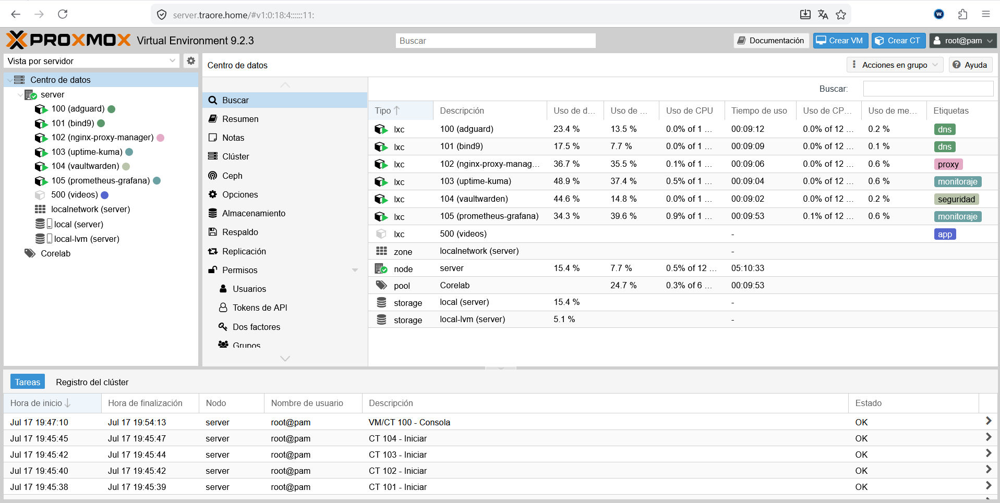

# ATK CoreLab

> Infraestructura personal de homelab — Proxmox, servicios autoalojados, monitorización y seguridad.

**Estado:** 🟡 En progreso — iniciado el 25/06/2026

---

## ¿Qué es esto?

ATK CoreLab es mi homelab personal, donde diseño, despliego y mantengo una
infraestructura autoalojada sobre mi propio hardware. El objetivo es construir
infraestructura real (no tutoriales aislados) cubriendo administración de
sistemas, redes, monitorización y seguridad — documentando cada decisión
técnica por el camino.

---

## Hardware

| Componente | Detalle |
|---|---|
| Equipo | HP ProDesk 600 G4 Mini |
| CPU | Intel Core i7-8700T |
| RAM | 32 GB DDR4 |
| Almacenamiento | ~440 GB NVMe |
| Hipervisor | Proxmox VE |


*HP ProDesk 600 G4 Mini corriendo Proxmox VE*


*Uso de recursos actual de todas las LXC*

---

## Arquitectura

```text
Internet
    │
Router
    │
Proxmox VE — HP ProDesk 600 G4 Mini
    │
    ├── LXC 100 — AdGuard Home
    ├── LXC 101 — BIND9
    ├── LXC 102 — Nginx Proxy Manager
    ├── LXC 103 — Uptime Kuma
    ├── LXC 104 — Vaultwarden
    └── LXC 105 — Prometheus + Grafana
```

Todos los servicios están detrás de un dominio interno (`traore.home`) con
certificado wildcard autofirmado, resuelto localmente mediante AdGuard Home +
BIND9 y expuestos vía Nginx Proxy Manager con HTTPS forzado.

Más detalle en [`docs/architecture/network.md`](docs/architecture/network.md).

---

## Servicios actuales

| Servicio | Función | Estado |
|---|---|---|
| AdGuard Home | DNS + bloqueo de publicidad/trackers | ✅ |
| BIND9 | Resolución DNS interna (`traore.home`) | ✅ |
| Nginx Proxy Manager | Proxy inverso + HTTPS | ✅ |
| Uptime Kuma | Monitorización de disponibilidad | ✅ |
| Vaultwarden | Gestor de contraseñas autoalojado | ✅ |
| Prometheus + Grafana | Métricas y dashboards | ✅ |

Cada servicio tiene su propia documentación en [`docs/services/`](docs/services/),
explicando por qué se eligió, cómo se integra con el resto del laboratorio, y
los problemas reales que surgieron.

---

## Estructura del repositorio

```text
ATK-CoreLab/
├── README.md
├── docs/
│   ├── architecture/
│   │   ├── network.md
│   │   └── hardware.md
│   └── services/
│       ├── adguard.md
│       ├── bind9.md
│       ├── nginx-proxy-manager.md
│       ├── uptime-kuma.md
│       ├── vaultwarden.md
│       └── prometheus-grafana.md
├── screenshots/
│   ├── hardware/
│   ├── adguard/
│   ├── bind9/
│   ├── nginx-proxy-manager/
│   ├── uptime-kuma/
│   ├── vaultwarden/
│   └── prometheus-grafana/
└── LICENSE
```

---

## Roadmap

### 🌐 Red y acceso
- [x] AdGuard Home — DNS + bloqueo de publicidad
- [x] BIND9 — DNS interno (`traore.home`)
- [x] Nginx Proxy Manager — proxy inverso + HTTPS
- [x] WireGuard — VPN (en el nodo Proxmox)
- [ ] Headscale — VPN mesh (gestión centralizada de WireGuard)
- [ ] OPNsense — firewall/router (bloqueado: requiere mini PC adicional)

### 🔑 Identidad y seguridad
- [x] Vaultwarden — gestor de contraseñas
- [ ] Authelia — SSO / 2FA para todos los servicios
- [ ] Wazuh — SIEM/XDR, detección de amenazas
- [ ] CrowdSec — protección colaborativa contra ataques
- [ ] Suricata — IDS/IPS, detección de intrusiones en red

### 📊 Monitorización
- [x] Uptime Kuma — disponibilidad de servicios
- [x] Prometheus + Grafana — métricas y dashboards
- [ ] ntfy — notificaciones push

### ⚙️ Automatización
- [ ] Ansible — gestión de configuración (pausado, retomar con más base de Linux/CLI)
- [ ] AWX — orquestación vía interfaz web (pausado, retomar con más base de Kubernetes)

### 💾 Almacenamiento y multimedia
- [ ] TrueNAS SCALE — almacenamiento centralizado en ZFS (bloqueado: requiere cable SATA + enclosure)
- [ ] Nextcloud — archivos personales (bloqueado por TrueNAS)
- [ ] Immich — fotos, backup de móvil (bloqueado por TrueNAS)
- [ ] Jellyfin — streaming multimedia (bloqueado por TrueNAS)

### 🖥️ Panel central
- [ ] Homarr — dashboard unificado de todos los servicios
---

*Última actualización: 08/07/2026*