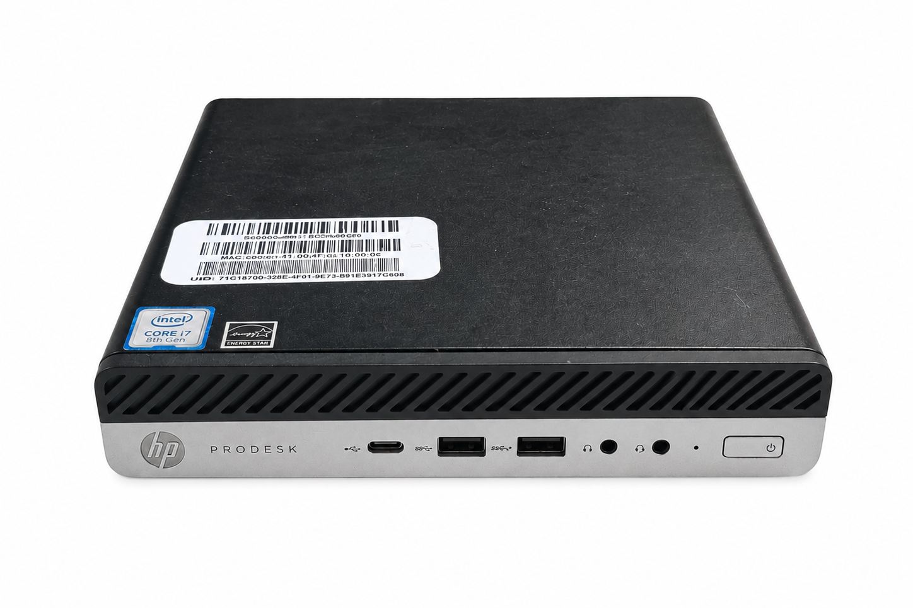
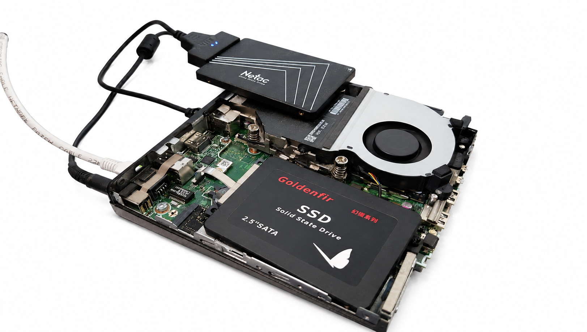
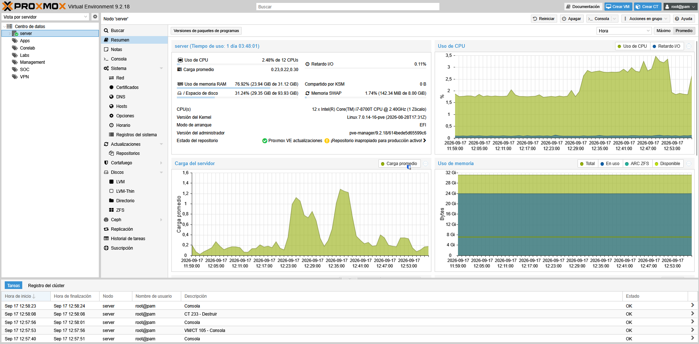
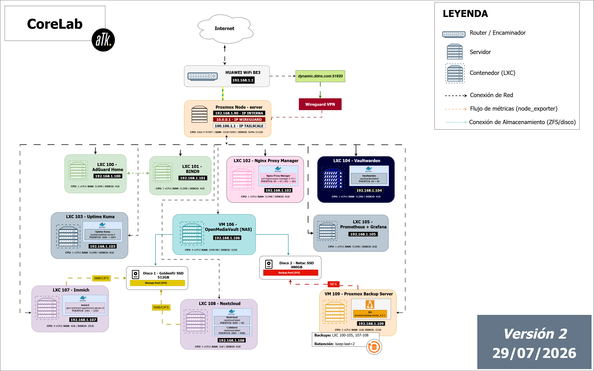

# CoreLab

> Infraestructura personal de homelab — Proxmox, servicios autoalojados, monitorización y seguridad.

> **Estado:** 🟢 Activo — desarrollo continuo


---

## Descripción

CoreLab es mi homelab personal, donde diseño, despliego y mantengo una infraestructura self-hosted sobre mi propio hardware. Su objetivo es construir un entorno real para aprender y experimentar con administración de sistemas, redes, monitorización y seguridad, documentando cada decisión técnica y la integración de todos los servicios.


---

## Índice

- [Hardware](#hardware)
- [Arquitectura](#arquitectura)
- [Servicios desplegados](#servicios-desplegados)
- [Estructura del repositorio](#estructura-del-repositorio)
- [Roadmap](#roadmap)

---

## Hardware

| Componente | Detalle |
|---|---|
| **Equipo** | HP ProDesk 600 G4 Mini |
| **CPU** | Intel Core i7-8700T (6 núcleos / 12 hilos) |
| **RAM** | 32 GB DDR4 3200MHz (2x16GB Dual Channel) |
| **Almacenamiento Principal** | 512 GB NVMe Micron PCIe 3x4 |
| **Almacenamiento secundario** | 500 GB SSD Goldenfir + 480 GB SSD Netac |
| **Hipervisor** | Proxmox VE 9.2 |

<p align="center">
  
  
    
</p>



*Resumen del hipervisor*

---
## Infraestructura

- **1 nodo Proxmox VE**
- **8 contenedores LXC**
- **2 máquinas virtuales**
- **10 servicios desplegados**
- **2 pools de almacenamiento (storage y backup)**
- **Backups diarios mediante Proxmox Backup Server**


>Resumen del hipervisor
---

## Arquitectura



Todos los servicios están detrás de un dominio interno (`traore.home`) con
certificado wildcard autofirmado, resuelto localmente mediante AdGuard Home +
BIND9 y expuestos mediante Nginx Proxy Manager con HTTPS forzado.

Más detalle en [`docs/architecture/network.md`](docs/architecture/network.md).

---

## Servicios desplegados

| Servicio | Función | Estado |
|---|---|---|
| [AdGuard Home](docs/services/adguard.md) | DNS y bloqueo de publicidad/trackers | ✅ |
| [BIND9](docs/services/bind9.md) | Resolución DNS interna (`traore.home`) | ✅ |
| [Nginx Proxy Manager](docs/services/nginx-proxy-manager.md) | Proxy inverso y gestión de HTTPS | ✅ |
| [Uptime Kuma](docs/services/uptime-kuma.md) | Monitorización de disponibilidad | ✅ |
| [Vaultwarden](docs/services/vaultwarden.md) | Gestor de contraseñas autoalojado | ✅ |
| [Prometheus + Grafana](docs/services/prometheus-grafana.md) | Monitorización de métricas y dashboards | ✅ |
| [OpenMediaVault](docs/services/openmediavault.md) | Almacenamiento NAS centralizado (SMB/NFS) | ✅ |
| [Immich](docs/services/immich.md) | Gestión y copia de seguridad de fotografías | ✅ |
| [Nextcloud](docs/services/nextcloud.md) | Almacenamiento y sincronización de archivos | ✅ |
| [Proxmox Backup Server](docs/services/proxmox-backup-server.md) | Backups incrementales con deduplicación | ✅ |

Cada servicio tiene su propia documentación en [`docs/services/`](docs/services/),
explicando por qué se eligió, cómo se integra con el resto del laboratorio, y
la utilidad dentro de la infraestructura.

---

## Estructura del repositorio

```text
CoreLab/
├── README.md
├── docs/
│   ├── architecture/
│   │   ├── network.md
│   │   └── hardware.md
│   └── services/
│       ├── adguard.md
│       ├── bind9.md
│       ├── nginx-proxy-manager.md
│       ├── uptime-kuma.md
│       ├── vaultwarden.md
│       ├── prometheus-grafana.md
│       ├── immich.md
│       ├── nextcloud.md
│       ├── openmediavault.md
│       └── proxmox-backup-server.md
├── screenshots/
│   ├── hardware/
│   ├── network/
│   ├── adguard/
│   ├── bind9/
│   ├── nginx-proxy-manager/
│   ├── uptime-kuma/
│   ├── vaultwarden/
│   ├── prometheus-grafana/
│   ├── immich/
│   ├── nextcloud/
│   ├── openmediavault/
│   └── proxmox-backup-server/
└── LICENSE
```

---

## Roadmap

### 🌐 Red y acceso
- [x] AdGuard Home
- [x] BIND9 — DNS interno (`traore.home`)
- [x] Nginx Proxy Manager
- [x] WireGuard — VPN 
- [x] Tailscale — VPN (contingencia)
- [ ] OPNsense - Firewall y Router 

### 🔑 Identidad y seguridad
- [x] Vaultwarden

### 📊 Monitorización
- [x] Uptime Kuma 
- [x] Prometheus + Grafana 

### 💾 Almacenamiento y multimedia
- [x] OpenMediaVault
- [x] Nextcloud 
- [x] Immich 
- [x] Proxmox Backup Server
 

---

**Última actualización:** 05/08/2026
