# Arquitectura de red — CoreLab

## Diagrama

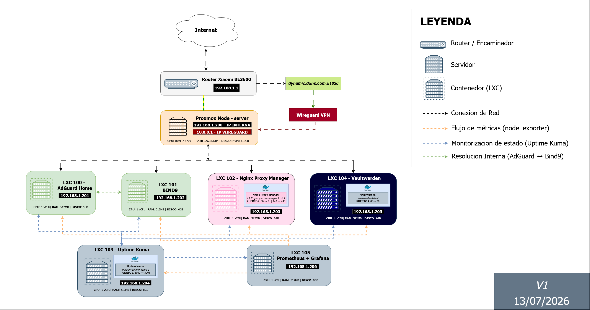

## Esquema de IPs

| Dispositivo / LXC | IP | Función |
|---|---|---|
| Router Xiaomi BE3600 | 192.168.1.1 | Puerta de enlace / Router |
| Proxmox Node - server | 192.168.1.200 | Host de virtualización |
| LXC 100 — AdGuard Home | 192.168.1.201 | DNS + filtrado de publicidad y trackers|
| LXC 101 — BIND9 | 192.168.1.202 | Resolución DNS interna |
| LXC 102 — Nginx Proxy Manager | 192.168.1.203 | Proxy inverso + certificación TLS |
| LXC 103 — Uptime Kuma | 192.168.1.204 | Monitorización de disponibilidad |
| LXC 104 — Vaultwarden | 192.168.1.205 | Gestor de contraseñas |
| LXC 105 — Prometheus + Grafana | 192.168.1.206 | Métricas y dashboards |

## Acceso remoto

- **WireGuard VPN**, IP interna del túnel: `10.0.0.1`
- Acceso vía DDNS mediante el puerto 51280 (Estàndar de Wireguard)
- No se exponen puertos de servicios directamente a internet; todo el acceso remoto pasa por el túnel VPN
  <br>
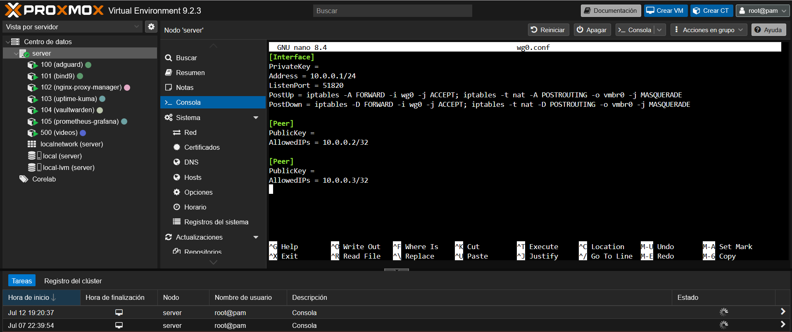
## Resolución DNS interna

- Dominio local: `*.traore.home`
- AdGuard Home actúa como DNS principal de la red, filtrando publicidad y trackers <br>

- Las consultas del dominio interno (`traore.home`) se reenvían desde AdGuard Home a BIND9, que resuelve los registros internos  <br>
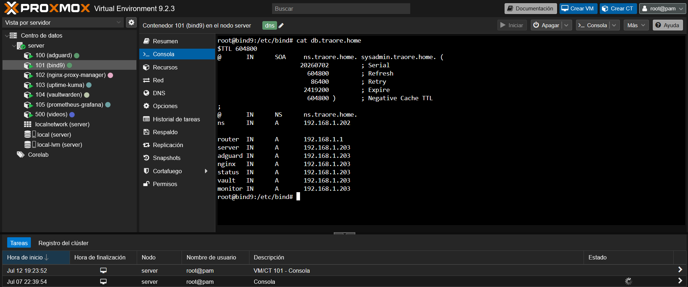
- El resto de tráfico DNS sale filtrado normalmente hacia internet

## Certificados TLS

- CA propia creada manualmente para el laboratorio
Con un certificado propio, nos permite no tener que usar el DNS dinámico, y dar mayor seguridad al tener todo centralizado en nuestro servidor local sin exponer otros puertos innecesarios.
- Certificado wildcard para `*.traore.home`, gestionado y renovado desde Nginx Proxy Manager  <br>
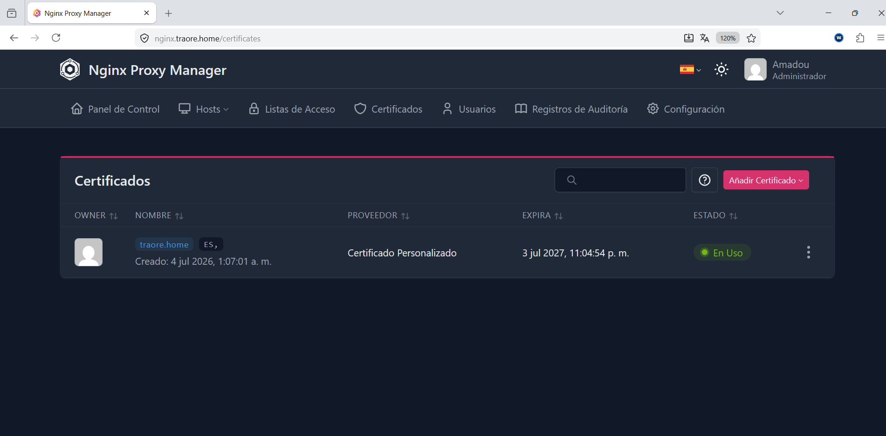
- HTTPS forzado en todos los servicios expuestos vía proxy  <br>
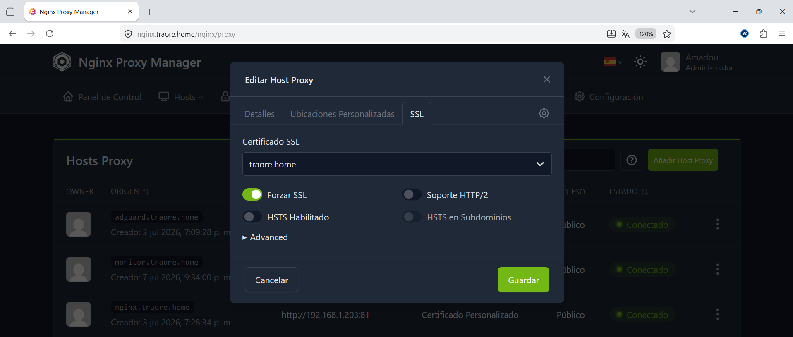
## Monitorización de la red

- **Prometheus + Grafana** (LXC 105): recolecta métricas de cada LXC mediante `node_exporter`, instalado individualmente en cada contenedor
- **Uptime Kuma** (LXC 103): Realiza checks periódicos de disponibilidad (ping/HTTP/DNS) sobre todos los servicios de la red. Esta configurado de manera que cada 10 minutos haga un chequeo de los servicios configurados.  <br>
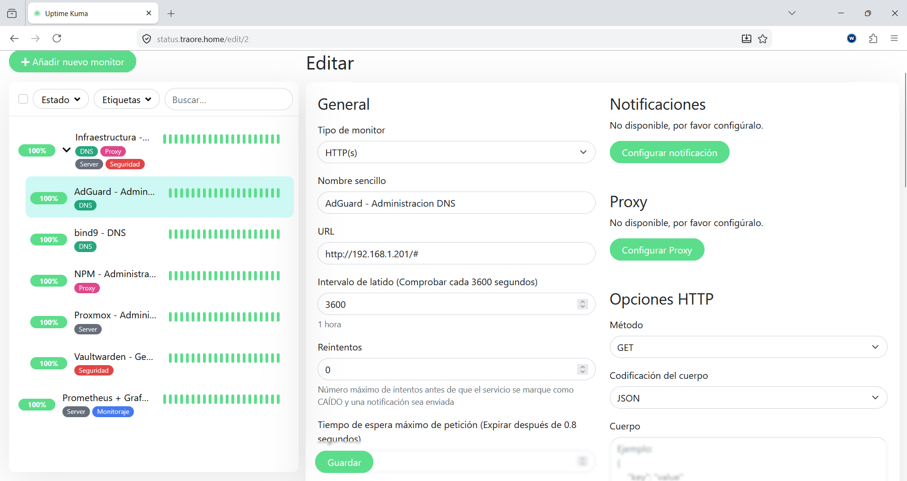
## Decisiones de diseño

- **Red plana (192.168.1.x)** en vez de VLANs: 
Principalmente por la simplicidad de configuración de red en un router no gestionado manualmente, como podría hacerse con software tipo OPNsense, entre otros. Además, al no tener una gran cantidad de dispositivos, resulta innecesario crear VLANs. Se permite que todos los dispositivos tengan acceso a todos los servicios.
- **WireGuard** sobre otras VPN (Tailscale, OpenVPN):
Se eligió WireGuard sobre alternativas como Tailscale principalmente para no depender de un proveedor externo y mantener control total sobre la VPN: gestión de claves, peers y túnel, todo alojado en el propio nodo Proxmox. La contrapartida es una configuración más manual, sin interfaz centralizada que tiene por ejemplo Tailscale, pero se prioriza la autonomía.
- **Nginx Proxy Manager + BIND9**: Utilizamos Nginx Proxy Manager para la gestión de certificados propios, y lo combinamos con BIND9 para la resolución de nombres interna.

## Problemas encontrados

- **Repositorio Enterprise activo sin suscripción:** Proxmox viene configurado por defecto con el repositorio `pve-enterprise`, que requiere una suscripción de pago. Al no tener suscripción, `apt-get update` fallaba y el dashboard mostraba el aviso "No hay una suscripción válida".  <br>
  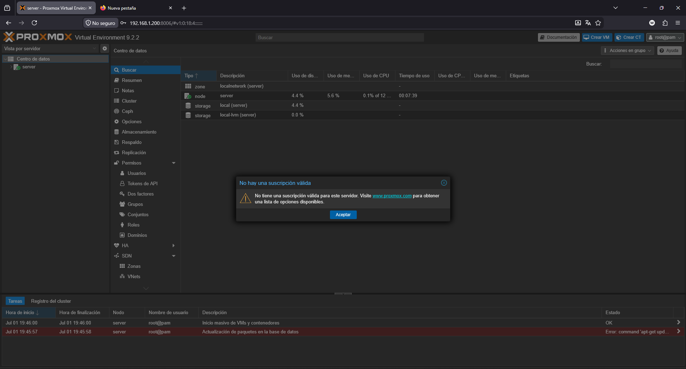

   **Sistema → Repositorios**, se confirmó que el repositorio `pve-enterprise` estaba activado (`Enabled: true`) apuntando a `enterprise.proxmox.com/debian/pve`, y no había ningún repositorio `pve-no-subscription` configurado.

  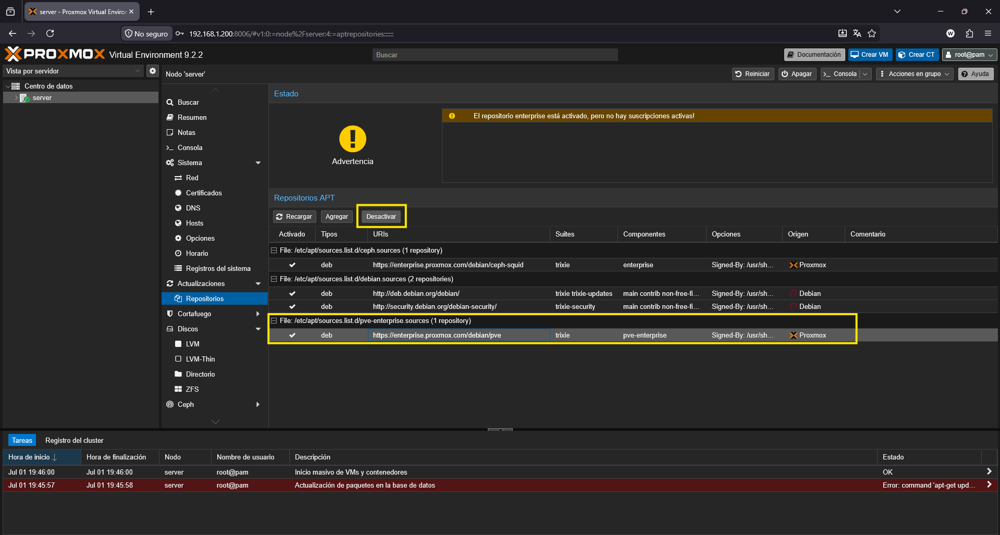

  **Solución:** se desactivó el repositorio `pve-enterprise` y se añadió el repositorio `pve-no-subscription`, gratuito y mantenido por la comunidad. Tras actualizar paquetes de nuevo, la actualización se completó sin errores. El aviso amarillo restante ("El repositorio no-subscription no es recomendado para uso en producción") es normal y esperado — es solo informativo, no un error.  <br>
  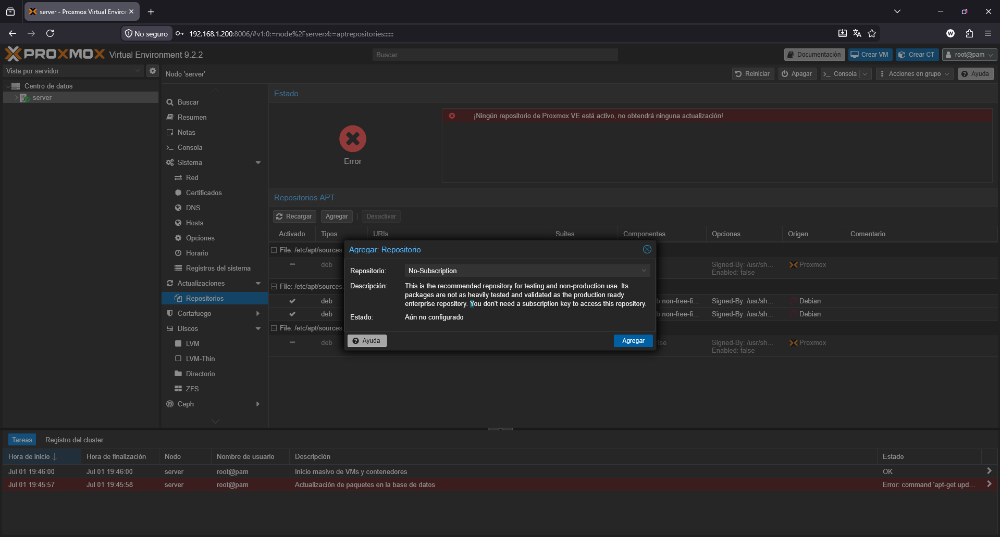
- ### Consola de Proxmox no carga a través del dominio interno

Al acceder a Proxmox mediante `server.traore.home` (a través de Nginx Proxy Manager), la consola noVNC de los nodos/LXC no cargaba, mostrando el siguiente error:
```
failed waiting for client: timed out
TASK ERROR: command '/usr/bin/termproxy 5900 --path /nodes/server --perm Sys.Console --vncticket-endpoint --verify-port --ticket-fd 6 -- /bin/login -f root' failed: exit code 1
```
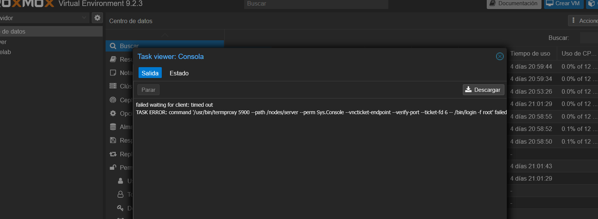
Accediendo directamente por IP (`192.168.1.200:8006`) la consola sí funcionaba, lo cual significaba un problema del proxy y no del hipervisor (Proxmox).

**Causa:** la consola de Proxmox usa una conexión WebSocket independiente de la conexión HTTPS normal para transmitir vídeo/teclado en tiempo real. Dentro de nuestro proxy no teníamos habilitado el soporte de WebSockets en ese host proxy, por lo que la conexión nunca llegaba a establecerse i no nos podiamos conectar correctamente de manera remota.

**Solución:** en Nginx Proxy Manager, dentro de la configuración del host `server.traore.home`, activar la opción **"Websockets Support"**. Tras esto, la consola volvió a funcionar con normalidad accediendo por el dominio interno.  <br>
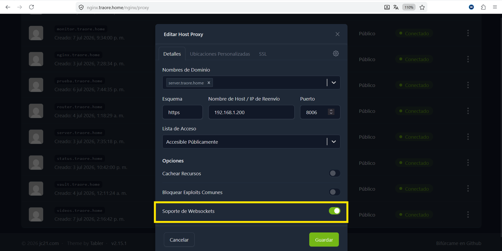