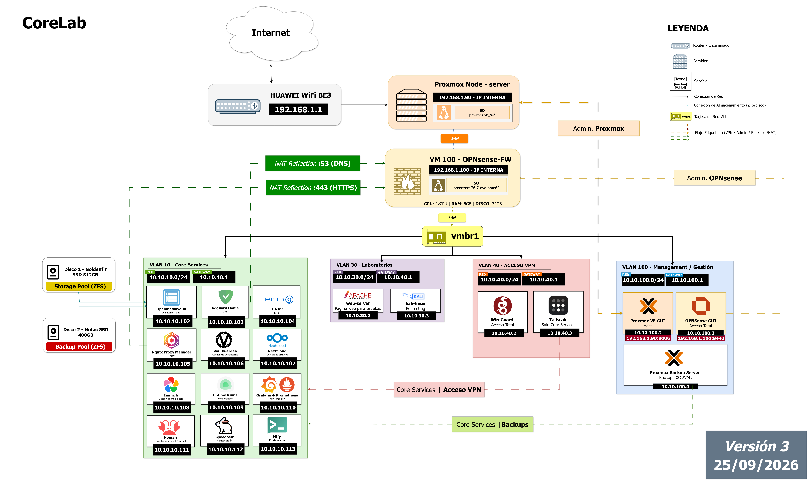
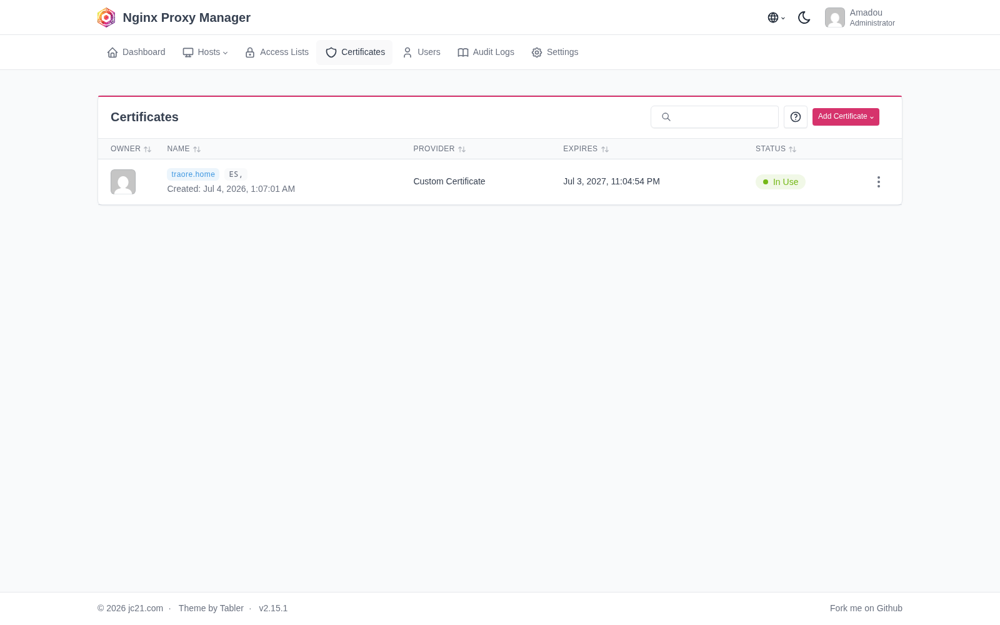
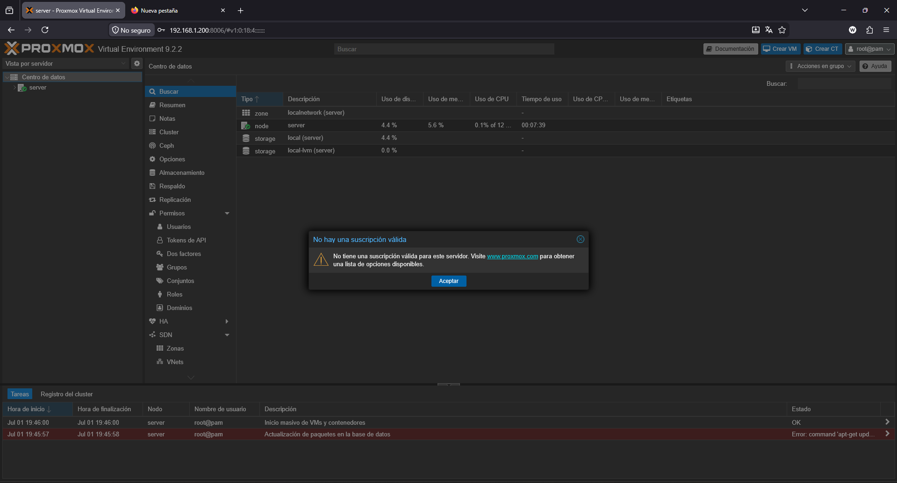
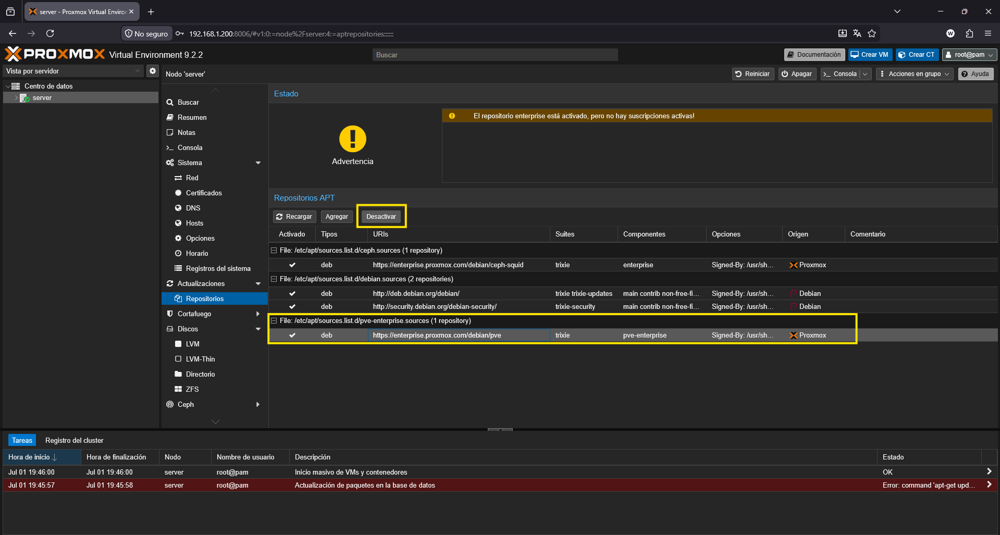
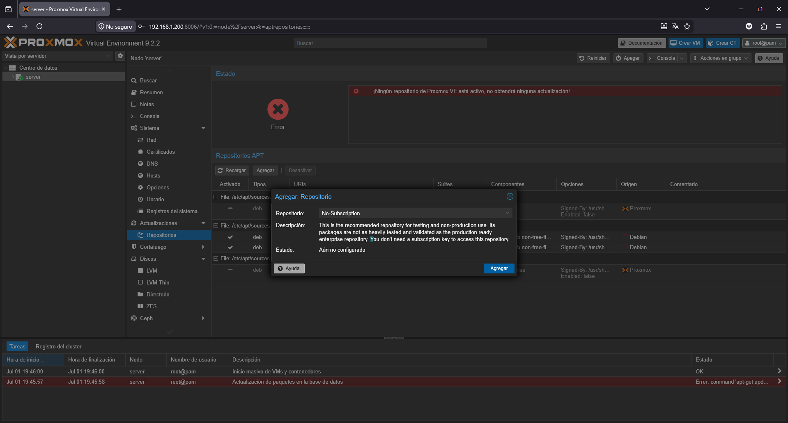
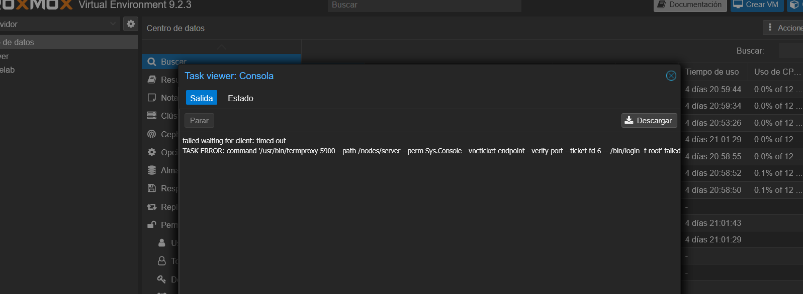
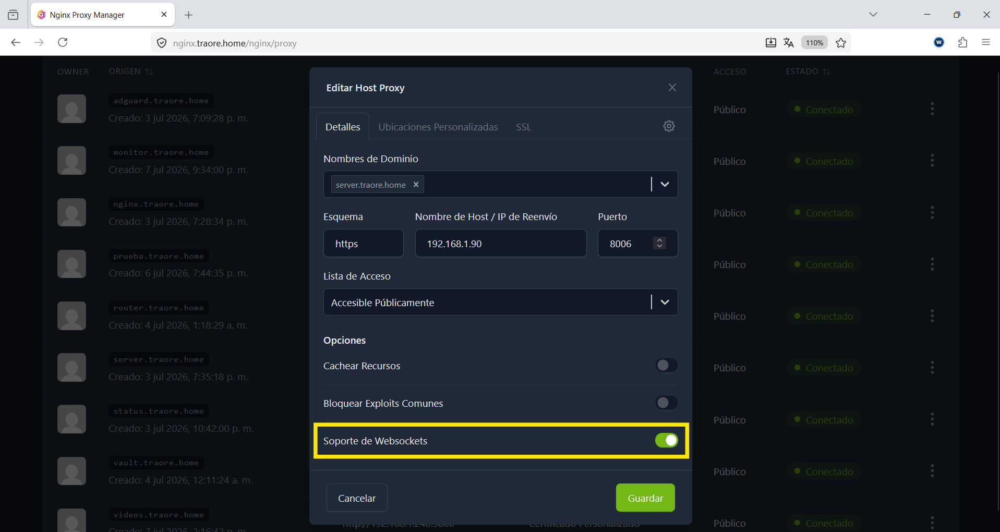

# Arquitectura de red — CoreLab

## Diagrama



> Nota: el diagrama refleja la numeración de contenedores e IPs originales del
> laboratorio; el esquema de IPs vigente es el de la tabla de abajo.

## Segmentación

| Segmento | VLAN | Red | Puerta de enlace |
|---|---|---|---|
| Red de acceso (Huawei BE3) | — | 192.168.1.0/24 | 192.168.1.1 |
| LAN de OPNsense (sin etiquetar) | — | 10.10.99.0/24 | 10.10.99.1 |
| Corelab (servidores) | 10 | 10.10.10.0/24 | 10.10.10.1 |
| SOC | 20 | 10.10.20.0/24 | 10.10.20.1 |
| Labs | 30 | 10.10.30.0/24 | 10.10.30.1 |
| VPN | 40 | 10.10.40.0/24 | 10.10.40.1 |
| Management | 100 | 10.10.100.0/24 | 10.10.100.1 |

- **OPNsense** (VMID 1001) es el firewall y la puerta de enlace de cada
  segmento; las VLANs llegan al nodo Proxmox mediante *trunk* 802.1Q sobre
  `vmbr1`.
- La **WAN de OPNsense** (`192.168.1.100/24`) cuelga de la red del router
  Huawei (`192.168.1.1`), que mantiene el enlace con Internet (doble NAT).
- **DNS forzado:** OPNsense redirige toda consulta saliente al puerto 53
  hacia AdGuard Home (`10.10.10.3`), de modo que ningún dispositivo pueda
  evadir el filtrado.

## Esquema de IPs

| Dispositivo / Contenedor | ID | IP | Función |
|---|---|---|---|
| Router Huawei BE3 | — | 192.168.1.1 | Puerta de enlace y acceso a Internet |
| OPNsense | VM 1001 | 192.168.1.100 | Firewall, gateways de las VLANs y NAT |
| Proxmox Node - server | — | 192.168.1.90 | Host de virtualización |
| Proxmox Backup Server | VM 1003 | 192.168.1.109 | Copias de seguridad |
| NAS (OpenMediaVault) | VM 102 | 10.10.10.2 | Almacenamiento |
| AdGuard Home | LXC 103 | 10.10.10.3 | DNS + filtrado de publicidad y trackers |
| BIND9 | LXC 104 | 10.10.10.4 | Resolución DNS interna |
| Nginx Proxy Manager | LXC 105 | 10.10.10.5 | Proxy inverso + certificados TLS |
| Vaultwarden | LXC 106 | 10.10.10.6 | Gestor de contraseñas |
| Nextcloud | LXC 107 | 10.10.10.7 | Nube privada de archivos |
| Immich | LXC 108 | 10.10.10.8 | Gestión de fotos y vídeos |
| Uptime Kuma | LXC 109 | 10.10.10.9 | Monitorización de disponibilidad |
| Prometheus + Grafana | LXC 110 | 10.10.10.10 | Métricas y dashboards |
| Homarr | LXC 111 | 10.10.10.11 | Dashboard de servicios |
| Speedtest | LXC 112 | 10.10.10.12 | Medición de velocidad |
| ntfy | LXC 113 | 10.10.10.13 | Notificaciones push |
| vpn-wireguard | LXC 402 | 10.10.40.2 | VPN de acceso remoto (wg-easy) |
| vpn-tailscale | LXC 403 | 10.10.40.3 | VPN de contingencia (Tailscale) |

## Acceso remoto

- **WireGuard (wg-easy, LXC 402 `vpn-wireguard`):** los clientes reciben IPs
  de `10.8.0.0/24` y enrutan el tráfico completo (*full tunnel*) con DNS
  `10.10.10.3`. El endpoint usa el DDNS `traore.duckdns.org:51820` (cron cada
  5 min en el propio contenedor): el Huawei reenvía el UDP 51820 a OPNsense,
  que mediante NAT *hairpin* lo entrega a `10.10.40.2`. La UI de gestión se
  publica solo en red interna como `wg.traore.home` (NPM →
  `10.10.40.2:51821`). Más detalle en
  [wireguard.md](../services/wireguard.md).
- **Tailscale (LXC 403 `vpn-tailscale`):** VPN de contingencia que actúa como
  *subnet router*, anunciando `10.10.0.0/16` y `192.168.1.0/24` a la red de
  Tailscale. Más detalle en [tailscale.md](../services/tailscale.md).
- Hacia Internet solo se reenvían **UDP 51820** (túnel WireGuard) y **TCP
  8443** (GUI de OPNsense); el resto de servicios no se exponen en el router
  y se publican únicamente en el dominio interno a través de Nginx Proxy
  Manager.

## Resolución DNS interna

- Dominio local: `*.traore.home`.
- **AdGuard Home** (`10.10.10.3`) es el DNS principal de la red: filtra
  publicidad y trackers, y deriva la zona interna a BIND9:

```yaml
# /opt/AdGuardHome/AdGuardHome.yaml
upstream_dns:
  - 94.140.14.14                # Quad9 (internet)
  - '[/traore.home/]10.10.10.4' # zona interna → BIND9
```

- **BIND9** (`10.10.10.4`) resuelve los nombres internos. Todos los servicios
  apuntan a Nginx Proxy Manager (`192.168.1.100`), el único punto de entrada
  HTTP/HTTPS:

```zone
; /etc/bind/db.traore.home (extracto)
@       IN  SOA  ns.traore.home. sysadmin.traore.home. ( 20261008 ... )
@       IN  NS   ns.traore.home.
ns      IN  A    10.10.10.4
router  IN  A    192.168.1.1    # Huawei BE3
server  IN  A    192.168.1.100  # Proxmox vía NPM
wg      IN  A    192.168.1.100  # UI de WireGuard vía NPM
```

- El resto de consultas salen filtrados hacia Quad9 (`94.140.14.14`). La zona
  completa y la configuración de AdGuard se documentan en
  [bind9.md](../services/bind9.md) y [adguard.md](../services/adguard.md).

## Certificados TLS

- **CA propia creada manualmente** para el laboratorio: con un certificado
  propio no hace falta depender del DNS dinámico ni de emisores externos, y
  todo queda centralizado en el servidor local sin exponer puertos
  innecesarios.
- **Certificado wildcard para `*.traore.home`**, gestionado y renovado desde
  Nginx Proxy Manager (creado el 04/07/2026, caduca el 03/07/2027):



- **HTTPS forzado** y soporte **WebSockets** activados en todos los hosts
  proxy publicados.

## Monitorización de la red

- **Prometheus + Grafana** (LXC 110): recolecta métricas de cada contenedor
  mediante `node_exporter`, instalado individualmente en cada LXC.
- **Uptime Kuma** (LXC 109): comprueba cada 10 minutos la disponibilidad
  (ping/HTTP/DNS) de todos los servicios de la red. Ver
  [uptime-kuma.md](../services/uptime-kuma.md).

## Decisiones de diseño

- **Segmentación con VLANs y OPNsense** (antes red plana): cada tipo de
  equipo vive en su segmento (servidores, labs, VPN, gestión), con OPNsense
  como firewall y puerta de enlace única de todos ellos. La segmentación
  estaba inicialmente descartada por simplicidad, pero al desplegar OPNsense
  se convirtió en la base para aislar funciones, controlar el tráfico entre
  VLANs y forzar el DNS de toda la red.
- **WireGuard (wg-easy) frente a OpenVPN:** se priorizó el control total —
  claves, peers y túnel alojados en el propio laboratorio, sin depender de
  ningún proveedor. La contrapartida es el mantenimiento propio del servicio,
  que wg-easy simplifica con su panel web y su API.
- **Nginx Proxy Manager + BIND9:** NPM gestiona la CA propia y el certificado
  wildcard, y BIND9 resuelve los nombres internos; juntos centralizan la
  exposición de servicios (HTTPS + WebSockets) en un único punto de entrada.

## Problemas encontrados

- **Repositorio Enterprise activo sin suscripción:** Proxmox viene configurado por defecto con el repositorio `pve-enterprise`, que requiere una suscripción de pago. Al no tener suscripción, `apt-get update` fallaba y el dashboard mostraba el aviso "No hay una suscripción válida".  <br>
  

   Dentro de **Sistema → Repositorios**, se confirmó que el repositorio `pve-enterprise` estaba activado (`Enabled: true`) apuntando a `enterprise.proxmox.com/debian/pve`, y no había ningún repositorio `pve-no-subscription` configurado.

  

  **Solución:** se desactivó el repositorio `pve-enterprise` y se añadió el repositorio `pve-no-subscription`, gratuito y mantenido por la comunidad. Tras actualizar paquetes de nuevo, la actualización se completó sin errores. El aviso amarillo restante ("El repositorio no-subscription no es recomendado para uso en producción") es normal y esperado — es solo informativo, no un error.  <br>
  
- ### Consola de Proxmox no carga a través del dominio interno

Al acceder a Proxmox mediante `server.traore.home` (a través de Nginx Proxy Manager), la consola noVNC de los nodos/LXC no cargaba, mostrando el siguiente error:
```
failed waiting for client: timed out
TASK ERROR: command '/usr/bin/termproxy 5900 --path /nodes/server --perm Sys.Console --vncticket-endpoint --verify-port --ticket-fd 6 -- /bin/login -f root' failed: exit code 1
```

Accediendo directamente por IP (`192.168.1.90:8006`) la consola sí funcionaba, lo cual significaba un problema del proxy y no del hipervisor (Proxmox).

**Causa:** la consola de Proxmox usa una conexión WebSocket independiente de la conexión HTTPS normal para transmitir vídeo/teclado en tiempo real. Dentro de nuestro proxy no teníamos habilitado el soporte de WebSockets en ese host proxy, por lo que la conexión nunca llegaba a establecerse y no nos podiamos conectar correctamente de manera remota.

**Solución:** en Nginx Proxy Manager, dentro de la configuración del host `server.traore.home`, activar la opción **"Websockets Support"**. Tras esto, la consola volvió a funcionar con normalidad accediendo por el dominio interno.  <br>


---

*Última actualización: 08/10/2026*
