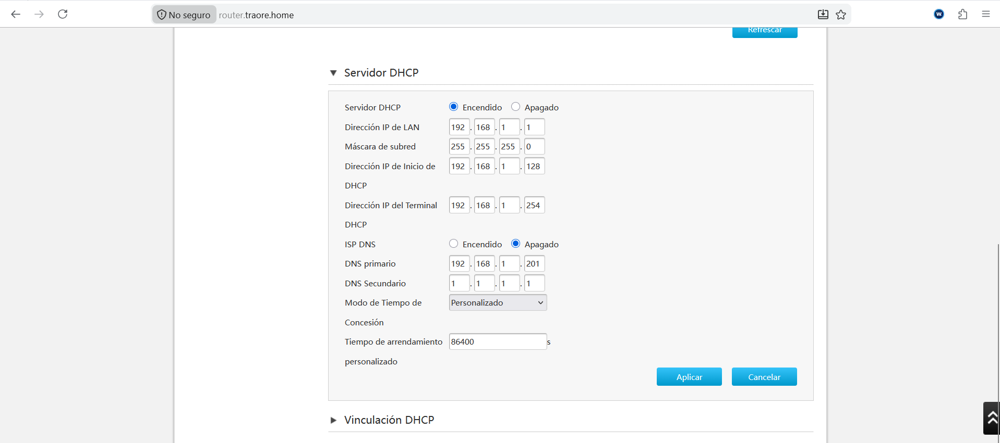
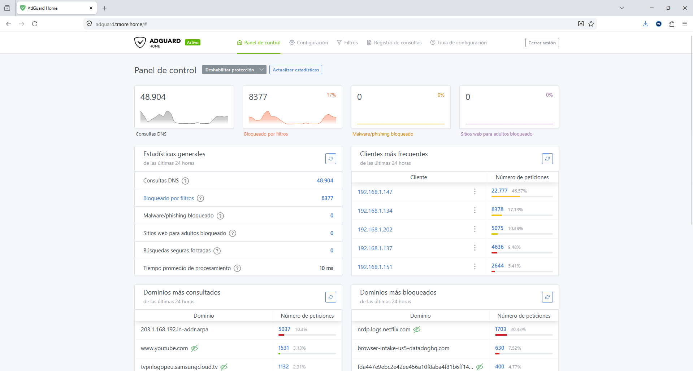
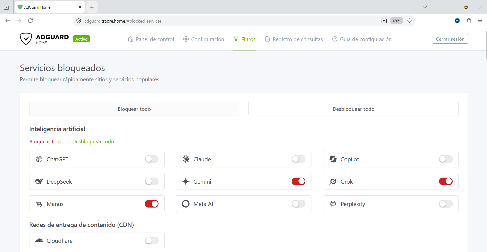
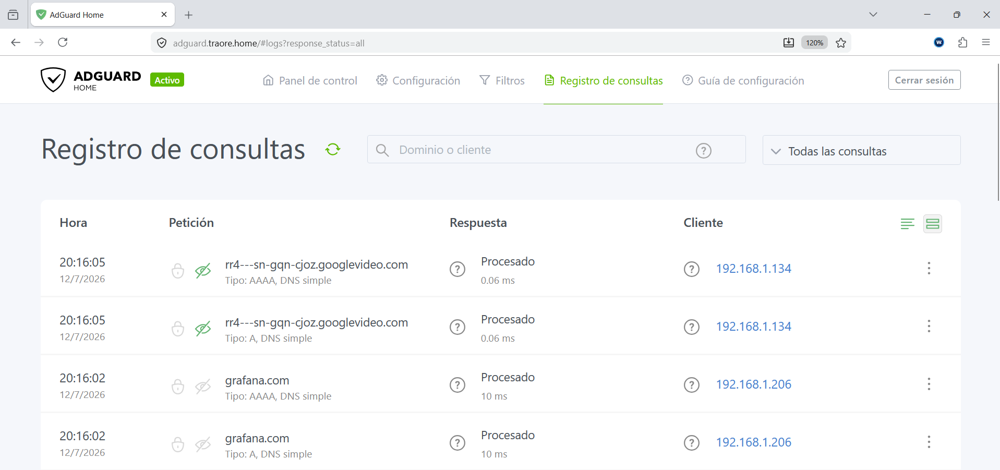

# AdGuard Home

## ¿Qué es?


Servidor DNS que bloquea publicidad, rastreadores y dominios maliciosos a nivel de red. Todos los dispositivos de la red pasan por aquí para resolver dominios, así que el filtrado se aplica sin tener que tocar nada en cada dispositivo por separado.

## ¿Por qué lo elegí?

Valoré Pi-hole primero, que es la opción más conocida y la que más se recomienda. Finalmente elegí AdGuard Home por dos motivos: la interfaz es más moderna, y trae soporte nativo para DNS-over-HTTPS/DoT sin depender de plugins adicionales. Tampoco necesita `dnsmasq` como Pi-hole, lo que hizo más sencilla la integración con mi DNS interno (BIND9)


## Cómo encaja en la infraestructura

Funciona en el LXC 100 (Debian 12) y actúa como DNS primario de la red. Está configurado directamente en el router de mi ISP, así que todos los dispositivos que se conectan a la red lo usan automáticamente, sin tener que tocar la configuración de cada uno por separado.
 

 Las consultas de `*.traore.home` se reenvían a BIND9 para resolver los dominios internos; el resto se resuelve contra DNS público. 
 
  Se accede vía `adguard.traore.home`, a través de Nginx Proxy Manager con HTTPS.


```text
Cliente
       │
       ▼
AdGuard Home (bloqueo + filtrado)
       │
       ├── *.traore.home → BIND9 (DNS interno)
       └── resto de dominios → Quad9 (Internet)
```

## Configuración relevante

- **Consultas DNS gestionadas:** en torno a 49.000 consultas/24h en la red doméstica
- **Bloqueo por filtros:** ~17% de las consultas totales bloqueadas (publicidad y rastreadores)
- **Tiempo medio de procesamiento:** 10 ms
- **Dominios más bloqueados:** dominios de telemetría y tracking (analíticas i logs de apps de streaming)
- **Clientes monitorizados:** cada dispositivo de la red aparece identificado por IP, con estadísticas individuales de las peticiones

## Ejemplos
### Panel de control de AdGuard Home

*Panel principal con estadísticas de consultas DNS, filtros aplicados y clientes más frecuentes.*
### Panel de bloqueo de servicios

*Ejemplo de dominios i servicios web bloqueados a partir de filtraje — Gemini, Grok, Manus.*
### Panel de registros de consultas

*Registro de consultas en tiempo real — se ve tanto tráfico externo (Google Video) como interno (resolución de `grafana.com` hacia el LXC 105)*