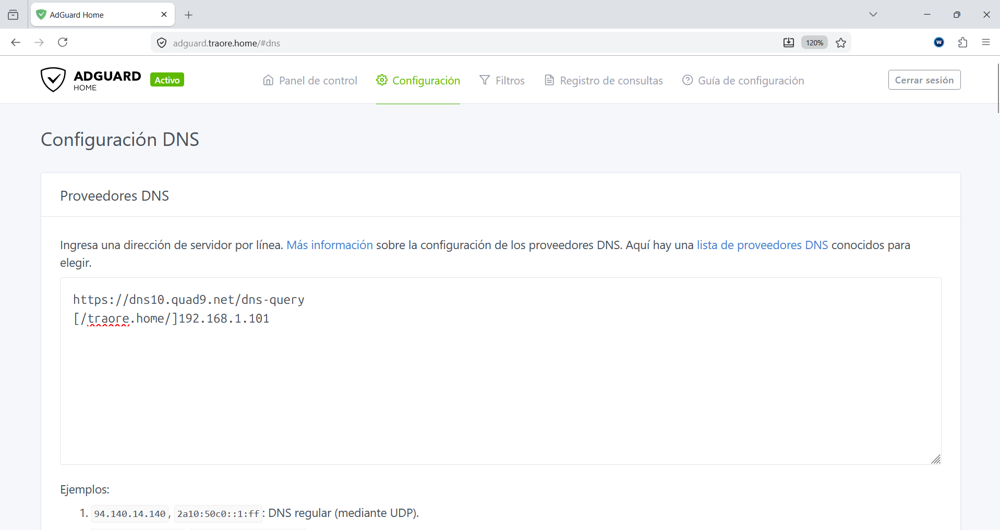
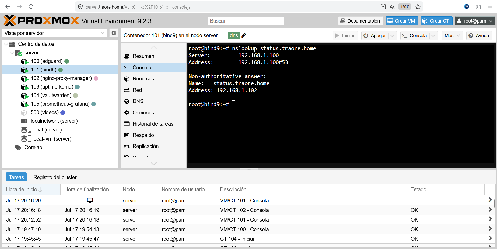

# BIND9

## ¿Qué es?

BIND9 es un servidor DNS que utilizo para resolver el dominio interno de mi
homelab (`traore.home`), asignando nombres a cada uno de mis servicios en
lugar de tener que recordar las direcciones IP y sus puertos.

## ¿Por qué lo elegí?

Ya tenía experiencia previa con BIND9, así que fue una elección bastante directa. Además es el servidor DNS más extendido a nivel profesional para gestionar zonas propias, con años de uso en producción en todo tipo de entornos (desde redes pequeñas hasta ISPs) y muchísima documentación disponible. También quería aprovechar para manejar una zona DNS real, en vez de quedarme solo con las reglas de reescritura simples que ofrece AdGuard Home.
## Cómo encaja en la infraestructura

- Desplegado en LXC 101 (Debian 12)
- Gestiona la zona interna `traore.home`
- AdGuard Home reenvía a BIND9 cualquier consulta que termine en `.traore.home`

- El resto de tráfico DNS lo resuelve AdGuard directamente contra el DNS público (Quad9)
- Cada servicio de la infraestructura tiene su propio registro dentro de esta zona (ej. `adguard.traore.home`, `vaultwarden.traore.home`, `monitor.traore.home`...)


```text
AdGuard Home
     │
     ├── *.traore.home ──► BIND9 (resuelve la zona interna)
     └── resto de dominios → Quad9 (Internet)
```

## Configuración relevante

- **Zona gestionada:** `traore.home`
- **Registros:** un registro A por cada servicio desplegado, apuntando a la IP de su LXC correspondiente
- **Relación con el resto del stack:** Es el paso intermedio entre AdGuard Home (que decide qué reenviar) y la resolución final de cada nombre interno.

## Ejemplos


*Resolución con NPM*

