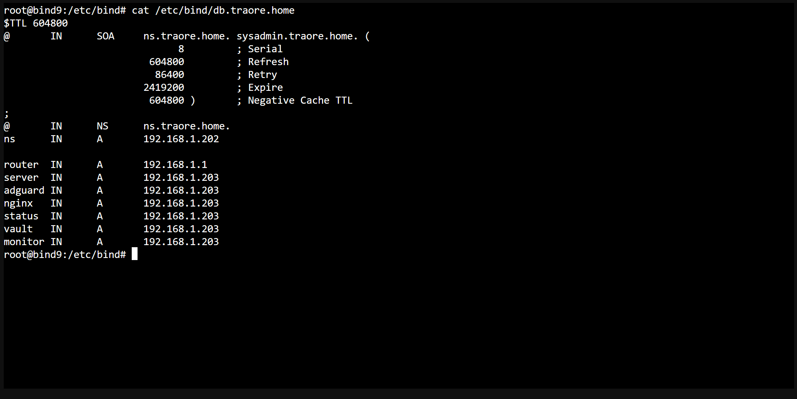

# BIND9

## ¿Qué es?

BIND9 es un servidor DNS que utilizo para resolver el dominio interno de mi
laboratorio (`traore.home`), asignando nombres a cada uno de mis servicios en
lugar de tener que recordar direcciones IP.

## ¿Por qué lo elegí?

Lo elegí porque es el servidor DNS más extendido y usado a nivel profesional
para gestionar zonas DNS propias, con documentación muy amplia y años de uso
en producción en todo tipo de entornos, desde pequeñas redes hasta ISPs.
Quería aprender a manejar una zona DNS real en vez de depender únicamente de
las reglas de reescritura simples que ofrece AdGuard Home por sí solo.

## Cómo encaja en mi infraestructura

- Desplegado en LXC 101 (Debian 12)
- Gestiona la zona interna `traore.home`
- AdGuard Home reenvía a BIND9 cualquier consulta que termine en `.traore.home`
- El resto de tráfico DNS lo resuelve AdGuard directamente contra upstream público
- Cada servicio de la infraestructura tiene su propio registro dentro de esta zona (ej. `adguard.traore.home`, `vaultwarden.traore.home`, `monitor.traore.home`...)

```text
AdGuard Home
     │
     ├── *.traore.home ──► BIND9 (resuelve la zona interna)
     └── resto de dominios ──► DNS upstream (Internet)
```

## Configuración relevante

- **Zona gestionada:** `traore.home`
- **Registros:** un registro A por cada servicio desplegado, apuntando a la IP de su LXC correspondiente
- **Relación con el resto del stack:** es el paso intermedio entre AdGuard Home (que decide qué reenviar) y la resolución final de cada nombre interno

## Capturas


*Fichero de zona con los registros de los servicios de traore.home*

## Próximos pasos

- [ ] Documentar el fichero de zona completo como referencia
- [ ] Añadir registros para los servicios pendientes (Authelia, TrueNAS, etc.) a medida que se desplieguen
- [ ] Revisar si conviene añadir un servidor BIND9 secundario para redundancia