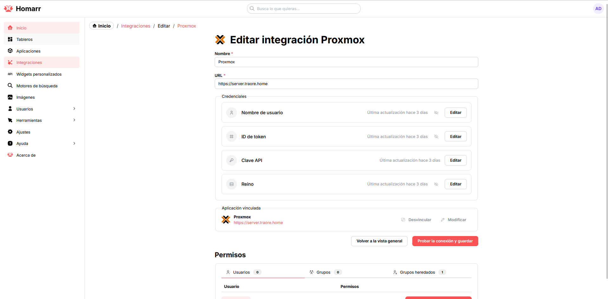
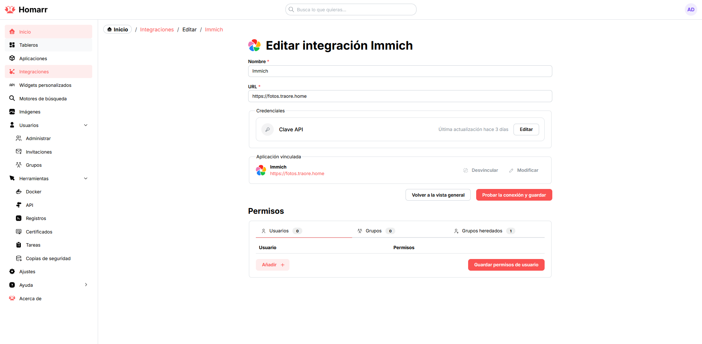

# Homarr — Panel de Inicio Centralizado

## Descripción

Homarr es un panel de inicio autoalojado que centraliza el acceso al resto
de servicios del CoreLab: tarjetas con enlaces, estado y accesos directos
para sustituir a una lista de marcadores manual, con integraciones nativas
contra otros servicios del laboratorio (Proxmox, Immich, etc.).

## Integración en la infraestructura

- **Contenedor:** LXC 111 `core-dashboard` (`10.10.10.11`, servicio en el
  puerto `7575`).
- **DNS:** registro `www IN A 192.168.1.100` en la zona BIND9
  (`traore.home`).
- **Proxy:** *proxy host* de Nginx Proxy Manager
  `https://www.traore.home → http://10.10.10.11:7575` con el certificado
  wildcard, HTTPS forzado y actualización de *websockets* habilitada.
- **Estado:** 🔄 — accesible y funcionando, con las integraciones y tarjetas
  aún en configuración.

## Ejemplos

*Configuración de la integración con Proxmox (URL, token y permisos)*

*Configuración de la integración con Immich*
