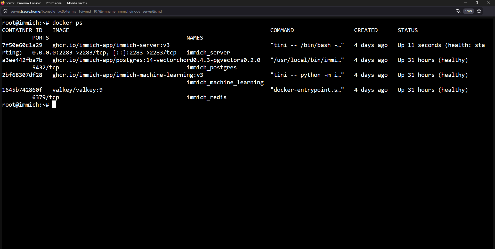
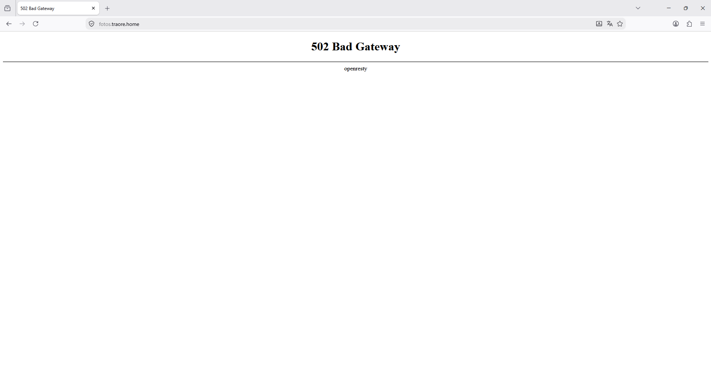
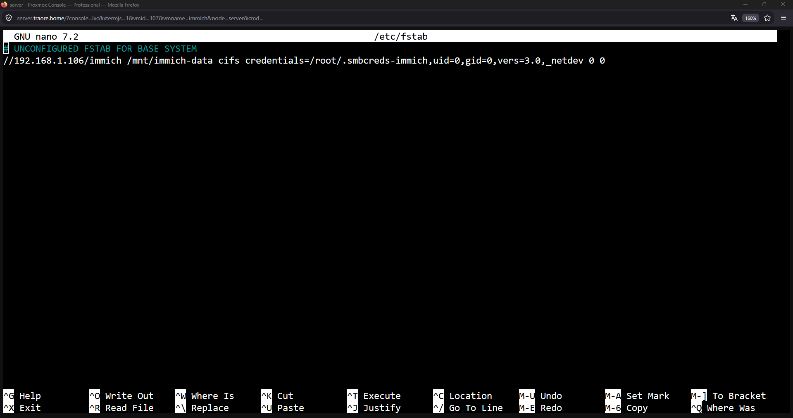
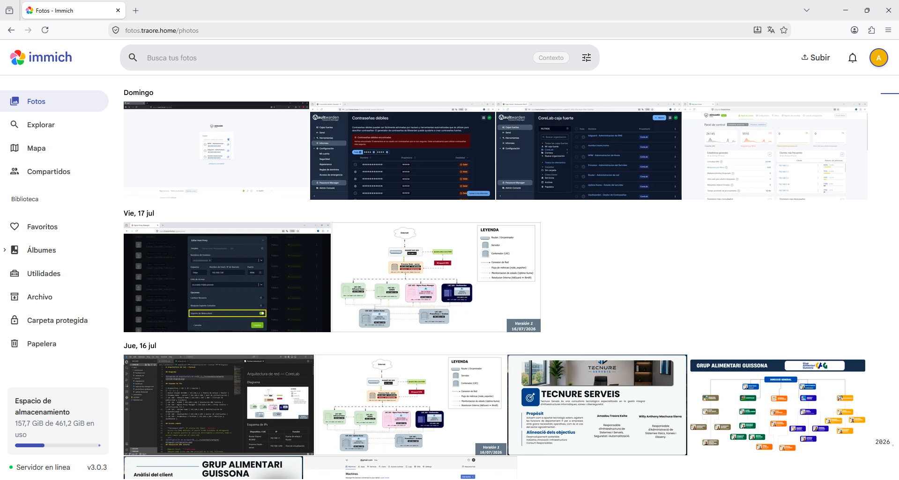
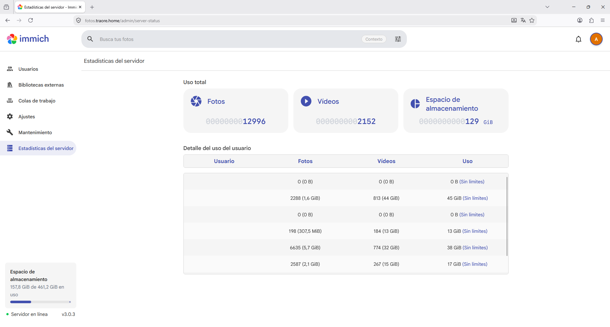
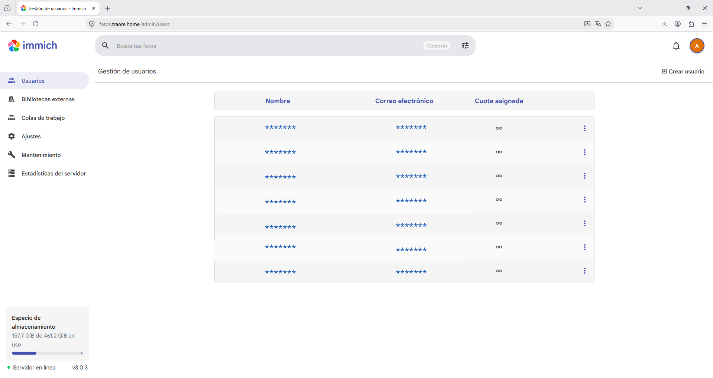

# Immich 

## Descripción

Immich es una plataforma self-hosted de gestión y backup de fotos y vídeos, pensada como alternativa a Google Photos. La utilizo para centralizar las fotos de casa y dejar de depender de servicios de terceros.

## Objetivo

Buscaba una alternativa self-hosted a Google Photos que permitiera subida automática desde móvil, dependiendo de mi hardware y poder más capacidad de almacenamiento.
## Integración en la infraestructura

- Desplegado en LXC 107, ampliada a 16GB RAM para soportar la subida masiva de fotos
- Almacenamiento en el pool ZFS `storage` de OpenMediavault (VM 106, `nas.traore.home`), a través del share compartido `immich`
- Acceso desde red interna y remoto vía WireGuard
- Miembros de la casa ya conectados y usando el servicio activamente, `+150GB ya ocupados`.

```text
Dispositivos (móvil/web)
     │
     └── fotos.traore.home ──► LXC 107 (Immich)
                                     │
                                     └── share SMB `immich` ──► pool ZFS `storage` (NAS, VM 106)
```

## Configuración 
- **Despliegue:** Despliegue dentro del contenedor, en Docker.

 
- **LXC:** 107, 4GB RAM
- **Almacenamiento:** share SMB `immich` sobre pool ZFS `storage`
- **Acceso:** red interna + WireGuard

## Incidencias encontradas

### Mount CIFS no persistente causa 502 en Immich y Nextcloud
 
El almacenamiento de Immich y Nextcloud vive en shares SMB del NAS (OpenMediavault, `192.168.1.106`), montados en cada LXC con `mount -t cifs` de forma manual, sin haberlo puesto en `/etc/fstab`. Al reiniciar el servidor o el contenedor LXC, el mount se pierde y Docker monta el punto como una carpeta local vacía en vez de la real. El servicio detecta que faltan sus archivos de verificación de integridad y entra en bucle de reinicio (`Restarting (1)`), provocando `502 Bad Gateway` en el proxy.
 
 
 
**Solución:** remontar el share manualmente y recrear los archivos marcador que falten (`.immich` en cada subcarpeta de Immich), luego reiniciar el contenedor. Pendiente añadir la entrada a `/etc/fstab` con `_netdev` en ambos servicios para que el mount sobreviva a reinicios.

 
 


## Ejemplos

*Panel principal mmostrando los archivos multimedia por fechas*


*Estadísticas actuales del servidor*


*Ejemplo de administración de usuarios*


