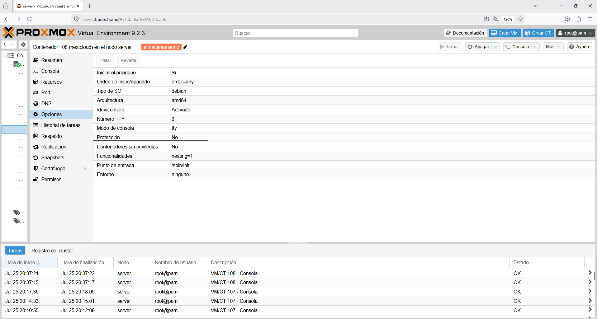
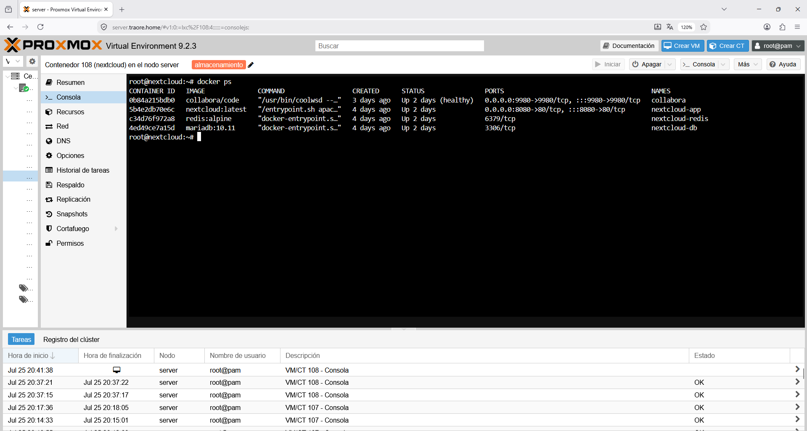
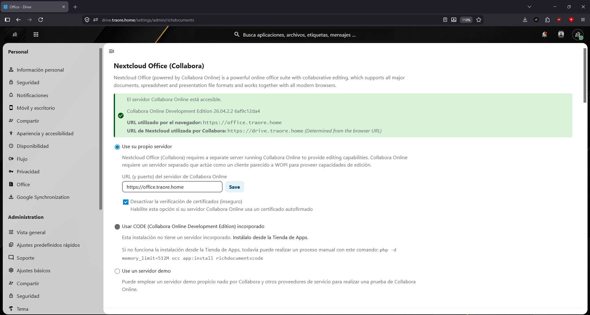
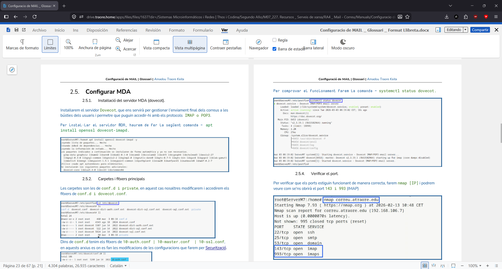
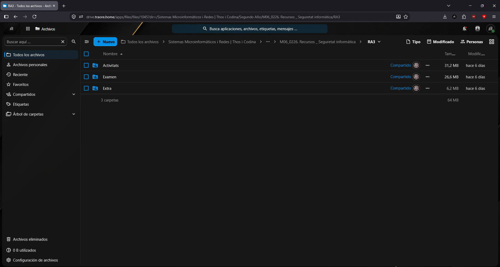

# Nextcloud

## ¿Qué es?

Nextcloud es una plataforma self-hosted de almacenamiento y sincronización de archivos, pensada como alternativa a Google Drive. La utilizo para centralizar mis archivos y dejar de depender de servicios de terceros.

## ¿Por qué lo elegí?

Buscaba una alternativa self-hosted a Google Drive que permitiera sincronización multiplataforma, edición colaborativa de documentos y control total sobre mis datos. El objetivo final es migrar todo mi Google Drive a Nextcloud y borrar el contenido de Drive.

## Cómo encaja en la infraestructura

- Desplegado en LXC 108 (hostname `nextcloud`), en modo **privilegiada** con nesting/keyctl activados, necesario para que funcionara el mount CIFS del share NAS junto con Docker.

 

- Corre vía Docker Compose con tres contenedores: `nextcloud-app`, `nextcloud-redis` (redis:alpine) y `nextcloud-db` (mariadb:10.11), expuesto en el puerto 8080

 

- Almacenamiento en el pool ZFS `storage` de OpenMediavault (VM 106, `nas.traore.home`), a través del share compartido `nextcloud`
- Nextcloud Office vía un contenedor Collabora Online independiente (`collabora`, imagen `collabora/code`) en la red Docker `root_nextcloud-net`, publicado en `192.168.1.108:9980` y expuesto por NPM como `office.traore.home`

```text
Dispositivos (web/desktop/móvil)
     │
     └── drive.traore.home ──► LXC 108 (nextcloud-app + redis + mariadb)
                                        │
                                        ├── share SMB `nextcloud` ──► pool ZFS `storage` (NAS, VM 106)
                                        └── office.traore.home ──► collabora (Docker, root_nextcloud-net)
```

## Configuración relevante

- **LXC:** 108, privilegiada, nesting/keyctl activados
- **Contenedores:** nextcloud-app, nextcloud-redis (redis:alpine), nextcloud-db (mariadb:10.11), puerto 8080
- **Office:** Collabora Online, puerto 9980, expuesto vía NPM con verificación de certificado backend desactivada


- **Almacenamiento:** share SMB `nextcloud` sobre pool ZFS `storage`

## Problemas y soluciones

- **CODE embebido (richdocumentscode) descartado:** fallaba por problemas de socket dentro de Docker. Se optó por un contenedor Collabora Online separado, que sí funcionó.
- **Mount CIFS no persistente:** el share SMB del NAS no estaba en `/etc/fstab`, así que no sobrevivía a reinicios de la LXC. Esto causaba el error "carpeta de datos inválida" al perderse el mount. Solución definitiva pendiente: añadir la entrada a fstab con `_netdev`. (Ver documentación de error compartida con Immich, que presenta el mismo problema.)

## Ejemplos

*Ejemplo de edición de documentos (docx) tras la implementación de Collabora*ç

*Ejemplo de carpetas i subcarpetas creadas*