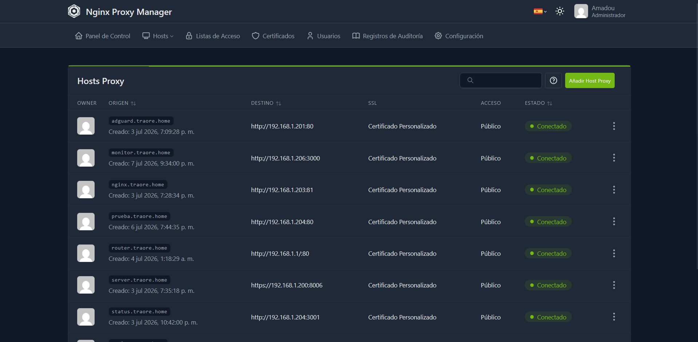

# Nginx Proxy Manager

## ¿Qué es?

Nginx Proxy Manager (NPM) es un proxy inverso con interfaz web que gestiona
el acceso a todos los servicios de mi homelab a través de un único punto
de entrada, aplicando HTTPS (TLS) a cada uno de ellos para que tengan seguridad.

## ¿Por qué lo elegí?

Lo elegí por encima de configurar Nginx manualmente, porque ofrece una interfaz web
sencilla para gestionar certificados y hosts proxy, sin tener que editar
ficheros de configuración manualmente cada vez que añado un servicio nuevo o un acceso web.
En el moemnto de añadir un nuevo servicio con seguridad cifrada, con NPM se hace mucho mas intuïtivo, y mucho mas ràpido minimizando errores al hacer--lo manualmente.

## Cómo encaja en mi infraestructura

- Desplegado en LXC 102 (Debian 12)
- Es el punto de entrada para acceder a todos los servicios mediante
  subdominios del dominio interno (`.traore.home`)
- Cada servicio tiene un "Proxy Host" configurado en NPM, con "Force SSL"
  activado para obligar a que incorporé la seguridad.
- Usa un certificado wildcard autofirmado, generado con una CA interna propia,
  válido para `*.traore.home`
- BIND9 resuelve cada subdominio a la IP de NPM, que redirige internamente al
  puerto correspondiente de cada LXC

```text
Cliente 
       │
       ▼
BIND9 resuelve *.traore.home → IP de Nginx Proxy Manager
       │
       ▼
Nginx Proxy Manager (HTTPS)
       │
       ├── server.traore.home   → Nodo Principal (Proxmox)
       ├── adguard.traore.home    → LXC 100
       ├── vaultwarden.traore.home → LXC 104
       ├── monitor.traore.home     → LXC 105
       └── ...
```

## Configuración relevante

- **Certificado:** wildcard autofirmado (`*.traore.home`), emitido por una CA interna propia
- **Force SSL:** activado en todos los proxy hosts.
- **Un proxy host por servicio**, cada uno apuntando a la IP interna y puerto de su LXC correspondiente.

## Ejemplos


*Listado de servicios publicados a través de Nginx Proxy Manager*

## Problemas encontrados

Al generar el certificado wildcard inicial tuve problemas de confianza del
navegador porque el SAN (Subject Alternative Name) no incluía correctamente
todos los subdominios necesarios. Tuve que regenerar el certificado con la CA
interna, asegurándome de incluir el wildcard completo en el SAN.

