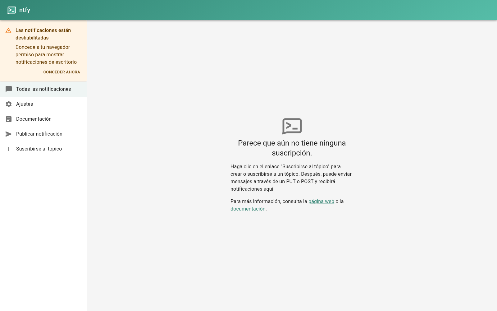
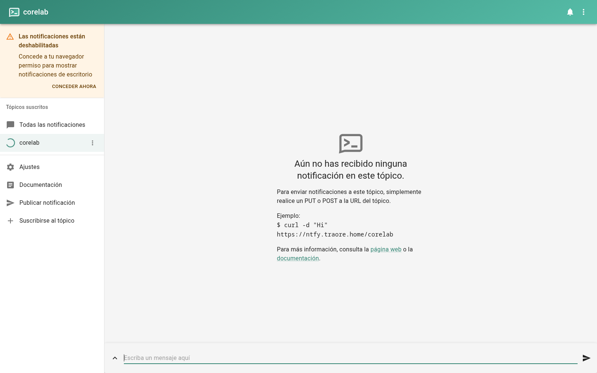

# ntfy — Notificaciones Push

## Descripción

ntfy es un servidor de notificaciones push simple: cualquier servicio
interno puede publicar avisos en un *topic* y los dispositivos familiares
los reciben como notificaciones en el móvil (app *ntfy*), sin necesidad de
cuentas ni dependencias de proveedores externos.

## Integración en la infraestructura

- **Contenedor:** LXC 113 `core-ntfy` (`10.10.10.13`, servicio en el puerto
  `80`).
- **DNS:** registro `ntfy IN A 192.168.1.100` en la zona BIND9
  (`traore.home`).
- **Proxy:** *proxy host* de Nginx Proxy Manager
  `https://ntfy.traore.home → http://10.10.10.13:80` con el certificado
  wildcard y HTTPS forzado.

## Problemas encontrados

- Si el contenedor está detenido, NPM devuelve **502 Bad Gateway**: reactivalo
  con `pct start 113`.

## Ejemplos

*Panel principal de ntfy con el menú de tópicos*

*Tópico `corelab` con el ejemplo de publicación por `curl` vía `https://ntfy.traore.home`*
