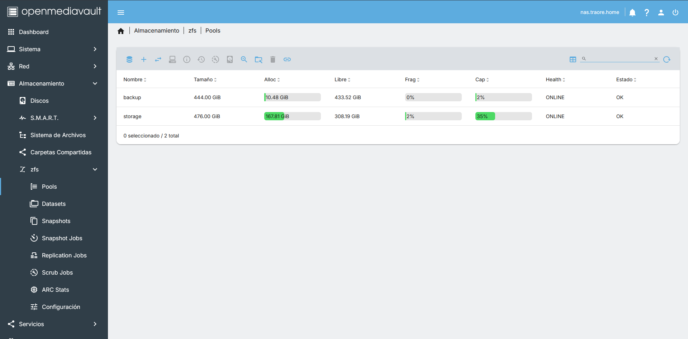
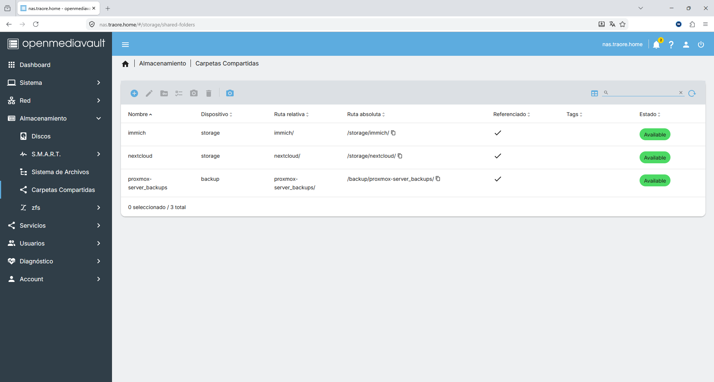
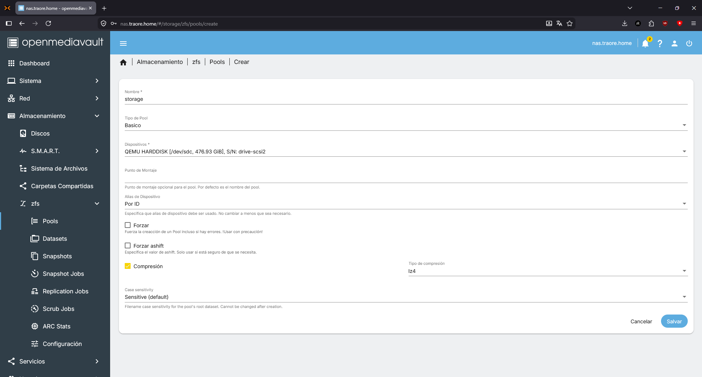
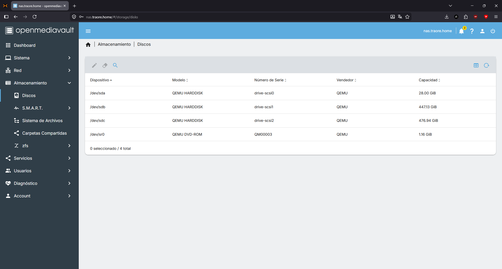

# OpenMediavault

## Descripción

OpenMediavault (OMV) es un sistema de gestión de almacenamiento en red (NAS) basado en Debian. Lo utilizo como el almacenamiento central de todo el homelab, sirviendo shares SMB/CIFS a los distintos servicios (Immich, Nextcloud, etc.) y como backend NFS para los backups de Proxmox Backup Server.

## Objetivo

OpenMediaVault proporciona el almacenamiento centralizado del laboratorio. Centraliza los volúmenes utilizados por los distintos servicios y separa el almacenamiento de los contenedores LXC, facilitando la administración, las copias de seguridad y la futura ampliación del sistema.

## Integración en la infraestructura

- Desplegado en VM 106 (`nas.traore.home`, `192.168.1.106`)
- Gestiona dos pools ZFS en passthrough:
  - `storage`: de donde salen los shares SMB/CIFS consumidos por otros servicios (Immich, Nextcloud)
  - `backup`: dedicado en exclusiva a servir como destino de backups vía NFS


- Los servicios de aplicación (Immich, Nextcloud) acceden vía mount CIFS/SMB desde sus respectivas LXC (107 Immich, 108 Nextcloud)
- Proxmox Backup Server (VM 109) accede al pool `backup` vía export NFS
- Expuesto en NPM como `nas.traore.home`

## Recursos asignados

| Recurso | Valor |
|---------|------:|
| **VM** | 106 |
| **vCPU** | 2 |
| **RAM** | 4 GB |
| **Disco SO** | 32 GB |
| **Almacenamiento** | Passthrough de 2 SSD |
| **IP** | 192.168.1.106 |
| **Hostname** | nas.traore.home |

```text
Servicios (Immich, Nextcloud, ...)
     │
     └── mount CIFS ──► OpenMediavault (VM 106, nas.traore.home)
                              │
                              ├── pool ZFS `storage`
                              └── pool ZFS `backup`
                                        │
                                        └── export NFS ──► Proxmox Backup Server (VM 109)
```


## Configuración

| Parámetro | Valor |
|-----------|-------|
| Sistema | OpenMediaVault |
| Pools | storage, backup |
| Filesystem | ZFS |
| Compartición | SMB/CIFS |
| Backups | NFS |
| Proxy | Nginx Proxy Manager |

## Ejemplos

*Vista de las carpetas que estan compartidas actualmente*


*Ejemplo de la creación de la pool storage*

!q[Resumen de los pools](../../screenshots/openmediavault/discos.png)
*Resumen de los pools configurados*


*Resumen de los discos configurados*