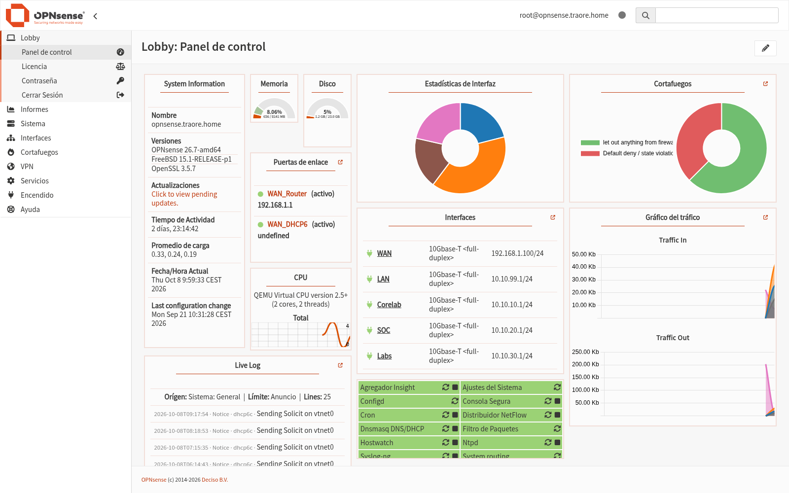
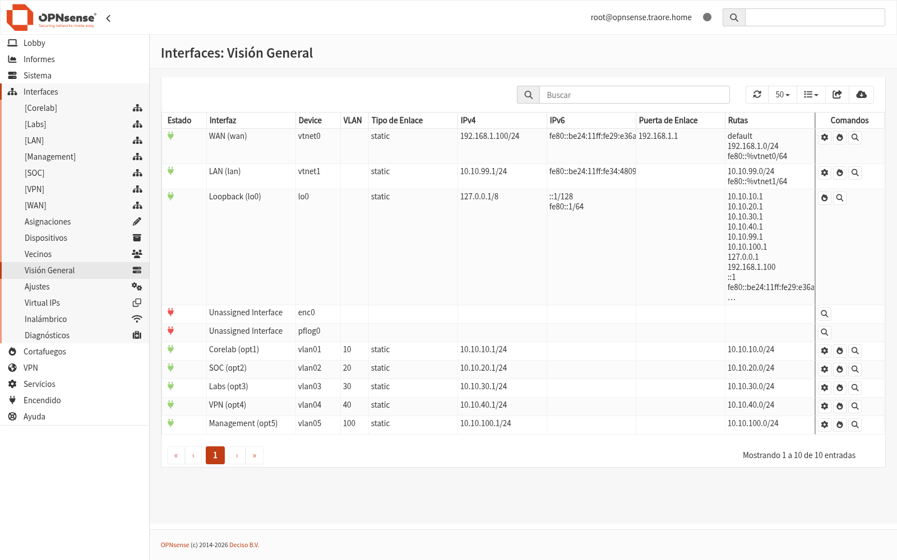
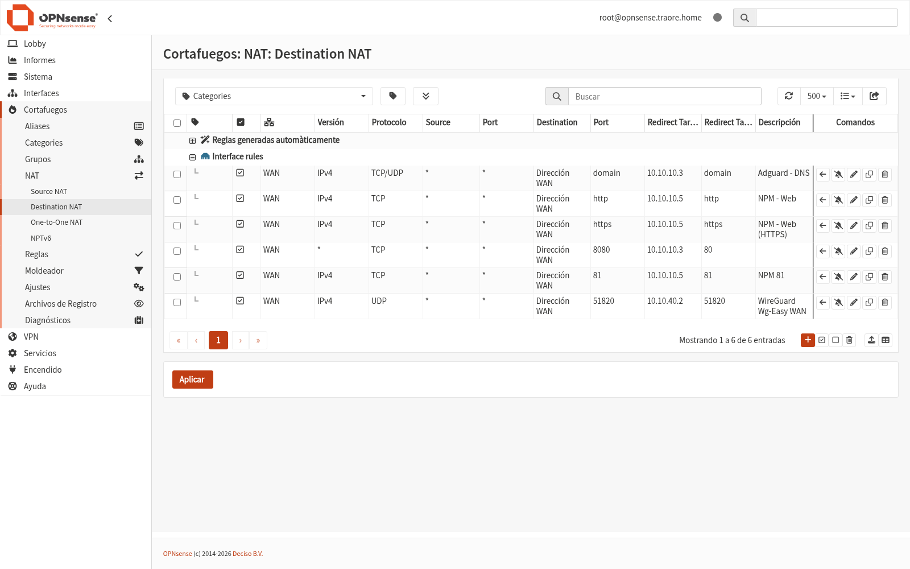
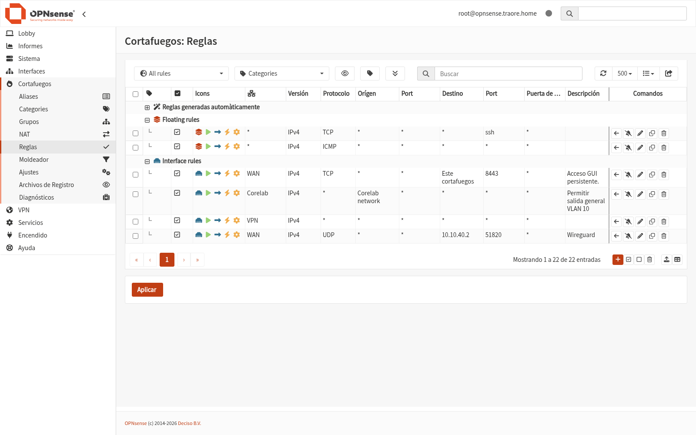
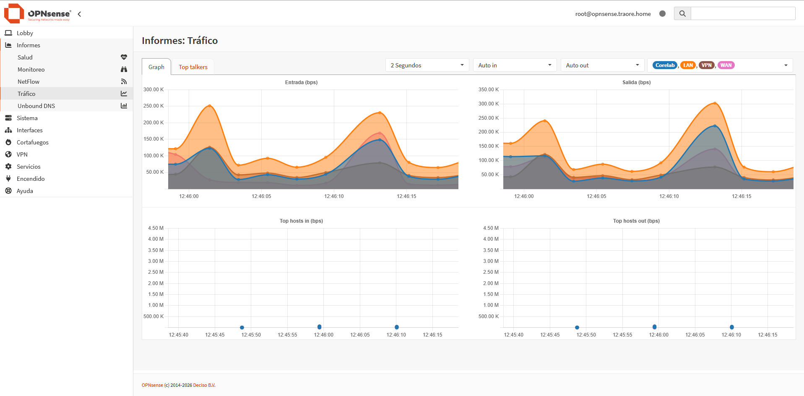

# OPNsense — Firewall y Router Inter-VLAN

## Descripción

OPNsense es el cortafuegos y router central del CoreLab. Implementa el
enrutamiento entre las distintas VLANs del laboratorio, el NAT saliente
compartido hacia Internet, el port-forwarding de los servicios publicados y
el filtrado de tráfico, actuando como única puerta de enlace de los
segmentos internos.

## Objetivo

- Segmentar el laboratorio en VLANs (Corelab, SOC, Labs, VPN, Management)
  con enrutamiento inter-VLAN controlado por cortafuegos.
- Centralizar la salida a Internet de todos los segmentos con NAT
  compartido por la WAN.
- Publicar los servicios internos (DNS, reverse proxy, VPN) mediante reglas
  NAT de destino con soporte de hairpin, y filtrar el tráfico entrante/saliente.

## Integración en la infraestructura

- **Máquina:** VM virtual en Proxmox (VMID `1001`), hostname
  `opnsense.traore.home`, OPNsense **26.7** (amd64) sobre FreeBSD 15.1.
- **Interfaces físicas:**
  - `WAN` (`vtnet0`): `192.168.1.100/24`, puerta de enlace `192.168.1.1`
    (router Huawei BE3). La red de acceso es de doble NAT
    (IP pública → Huawei → OPNsense).
  - `LAN` (`vtnet1`): `10.10.99.1/24` (sin etiquetar) — *trunk* hacia el
    `vmbr1` de Proxmox.
- **VLANs (802.1Q sobre `vtnet1`):**

  | Interfaz | VLAN | Red | Direccionamiento |
  |---|---|---|---|
  | Corelab | 10 | `10.10.10.0/24` | `10.10.10.1` (GW) |
  | SOC | 20 | `10.10.20.0/24` | `10.10.20.1` (GW) |
  | Labs | 30 | `10.10.30.0/24` | `10.10.30.1` (GW) |
  | VPN | 40 | `10.10.40.0/24` | `10.10.40.1` (GW) |
  | Management | 100 | `10.10.100.0/24` | `10.10.100.1` (GW) |

- **NAT saliente:** todas las redes internas salen por `WAN` con rango
  `1024:65535` y puertos estáticos para ISAKMP.
- **NAT de destino (port-forward, con hairpin en todas las interfaces):**

  | Puerto | Destino | Servicio |
  |---|---|---|
  | 53/tcp+udp | `10.10.10.3` | AdGuard Home (DNS *hijacking*) |
  | 80/tcp | `10.10.10.5` | Nginx Proxy Manager (HTTP) |
  | 443/tcp | `10.10.10.5` | Nginx Proxy Manager (HTTPS) |
  | 8080/tcp | `10.10.10.3:80` | Interfaz de AdGuard Home |
  | 81/tcp | `10.10.10.5:81` | Interfaz de NPM |
  | 51820/udp | `10.10.40.2:51820` | wg-easy (VPN WireGuard) |

- **Reglas de filtrado:** política por defecto de denegación; se permiten
  SSH/ICMP (reglas flotantes), acceso a la GUI del cortafuegos (puerto
  `8443`), salida general de las VLANs `Corelab` y `VPN`, y UDP `51820`
  hacia wg-easy en la WAN.
- **Servicios locales:** `dnsmasq` (resolución/forward DNS), `ntpd`
  (hora), NetFlow y Syslog-ng (informes y registro).
- **GUI de administración:** `http://192.168.1.100:8443` (HTTP, puerto
  `8443`), usuario `root`.

## Problemas encontrados

- **Doble NAT (Huawei + OPNsense):** con solo el NAT de OPNsense, los
  paquetes que vuelven a entrar desde la propia red (hairpin) perdían la
  traducción de destino. Se resolvió aplicando cada regla *rdr* en todas
  las interfaces (grupos *Interface rules*), de modo que el tráfico
  interno hacia la IP pública se traduzca igual que el entrante desde
  Internet; verificado con `tcpdump` en el servidor wg-easy.
- **Bypass del DNS filtrado:** cualquier cliente que apuntara a un DNS
  público ignoraría AdGuard Home. Se evitó con reglas *rdr* de puerto 53
  (tcp/udp) hacia `10.10.10.3` en todas las interfaces.
- **GUI sin TLS:** la web de administración escucha en el puerto `8443`
  con HTTP (no HTTPS). Al probar `https://…:443` la conexión fallaba
  (`wrong version number`); la ruta correcta es
  `http://192.168.1.100:8443`.

## Ejemplos

*Lobby: panel de control con interfaces, puertas de enlace y estado del sistema*

*Visión general de interfaces: WAN, LAN, Loopback y las VLANs 10/20/30/40/100*

*NAT de destino: DNS → AdGuard, HTTP/HTTPS → NPM y UDP 51820 → wg-easy*

*Reglas de filtrado: acceso a la GUI (8443), salida de VLANs y WireGuard en WAN*

*Informes → Tráfico: gráficas de entrada/salida por interfaz*
