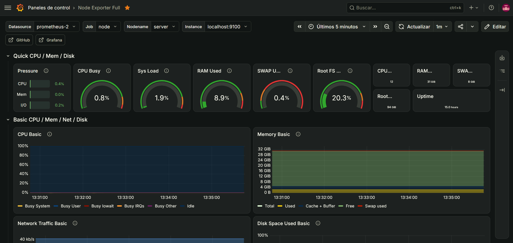

# Prometheus + Grafana

## ¿Qué es?

Prometheus es un sistema de monitorización que recolecta y almacena métricas
(CPU, RAM, disco, red...) de los servidores de mi infraestructura. Grafana se
conecta a esos datos y los transforma en dashboards visuales, permitiendo ver
el estado de cada host en tiempo real.

## ¿Por qué lo elegí?
Lo elegí principalmente por encima de **Zabbix** porque actualmente es la
herramienta más usada para monitorización en entornos cloud y Kubernetes,
tecnologías que están en auge hoy en día. Cuenta con más soporte y una
comunidad más activa y que esta en crecimiento, lo que también facilita encontrar
documentación y resolver problemas.

## Cómo encaja en mi infraestructura

Desplegado en la LXC 105 (Debian 12), junto a los tres componentes del stack:

- **Node Exporter** corre en la propia LXC y expone las métricas del sistema
  (CPU, RAM, disco, red) en el puerto 9100.
- **Prometheus** recoge esas métricas cada 15 segundos (scraping) y las
  almacena en su base de datos interna, disponible en el puerto 9090.
- **Grafana** se conecta a Prometheus como fuente de datos y renderiza los
  dashboards, disponible en el puerto 3000.

El servicio está publicado a través de Nginx Proxy Manager con HTTPS, accesible
en `monitor.traore.home`, usando el mismo certificado wildcard interno que el
resto de servicios del laboratorio.

Actualmente monitoriza únicamente la propia LXC 105 mediante Node Exporter, y el nodo prinicpal `server`; está pendiente añadir Node Exporter al resto de LXCs para tener visibilidad de toda la infraestructura, y un exporter específico para el propio nodo Proxmox (PVE Exporter).

## Configuración relevante

- **Intervalo de scraping:** cada 15 segundos (valor por defecto de Prometheus)
- **Target monitorizado:** `localhost:9100` (Node Exporter de la propia LXC 105)
- **Dashboard importado:** [Node Exporter Full (ID 1860)](https://grafana.com/grafana/dashboards/1860),
  el dashboard de referencia de la comunidad para visualizar métricas de
  Node Exporter — incluye CPU, memoria, disco, red y presión del sistema
- **Datasource en Grafana:** Prometheus, apuntando a `http://localhost:9090`
- **Acceso:** `monitor.traore.home` (HTTPS vía Nginx Proxy Manager)

## Problemas encontrados

Al instalar Grafana siguiendo su documentación oficial, la guía indicaba
descargar la clave GPG del repositorio con el nombre `gpg-full.key`, mientras
que en algunas guías/tutoriales más antiguos aparece como `gpg.key`. Usar el
nombre incorrecto provoca que la clave no se importe bien y que `apt update`
falle al validar el repositorio de Grafana. Lo resolví verificando el comando
exacto en la documentación oficial actualizada de Grafana antes de ejecutarlo.

## Capturas

*Dashboard "Node Exporter Full" mostrando CPU, RAM, disco y red en tiempo real*

## Próximos pasos

- [ ] Añadir Node Exporter al resto de LXCs para monitorizar toda la infraestructura, no solo esta LXC
- [ ] Desplegar PVE Exporter para obtener métricas del propio nodo Proxmox (VMs, LXCs, storage)
- [ ] Importar el dashboard [Proxmox via Prometheus (ID 10347)](https://grafana.com/grafana/dashboards/10347)
- [ ] Configurar alertas básicas (ej. uso de disco > 85%, servicio caído)