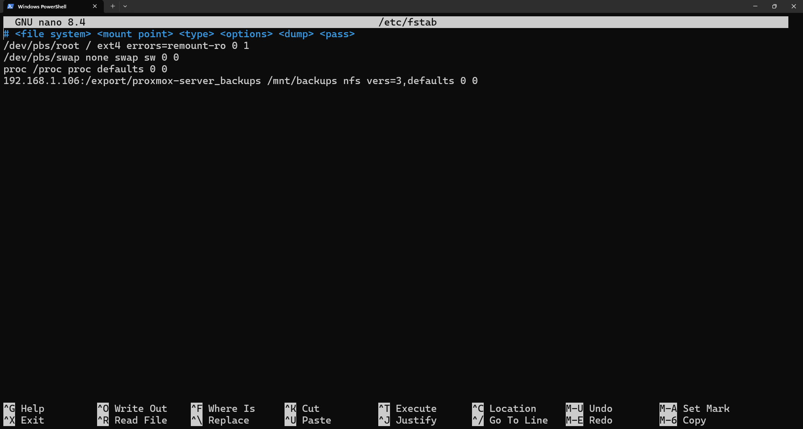
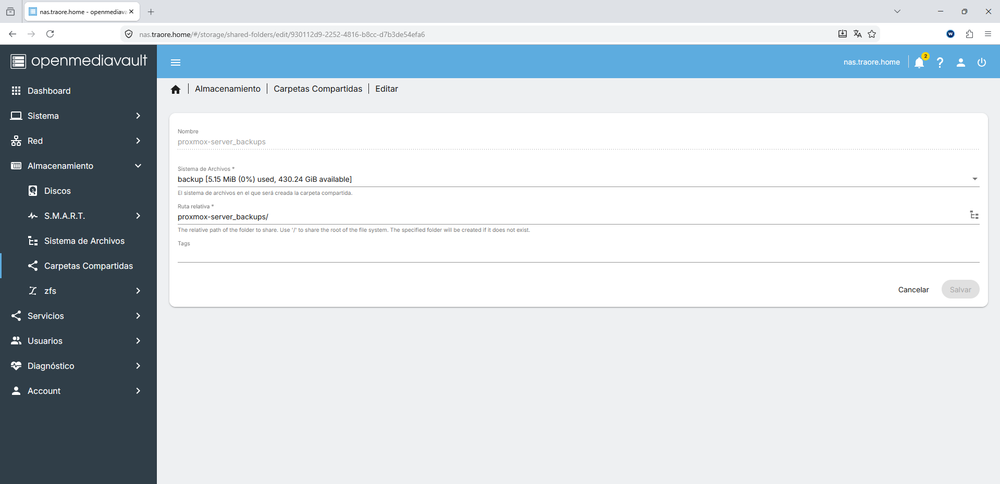
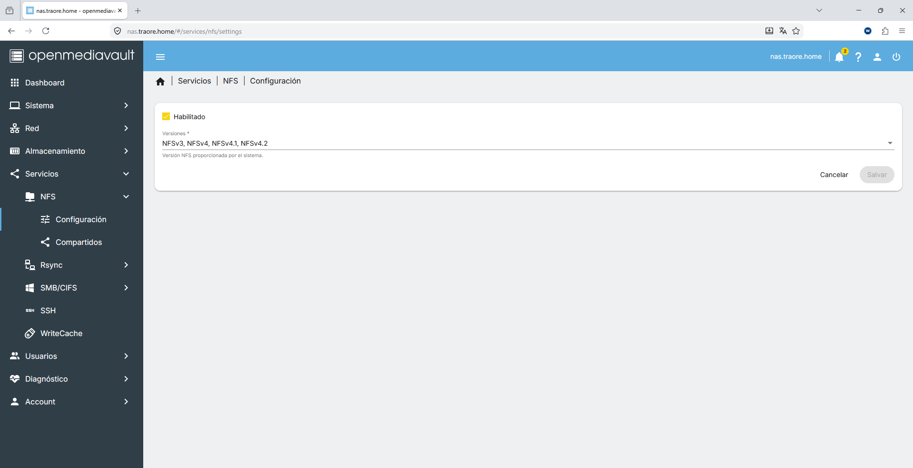
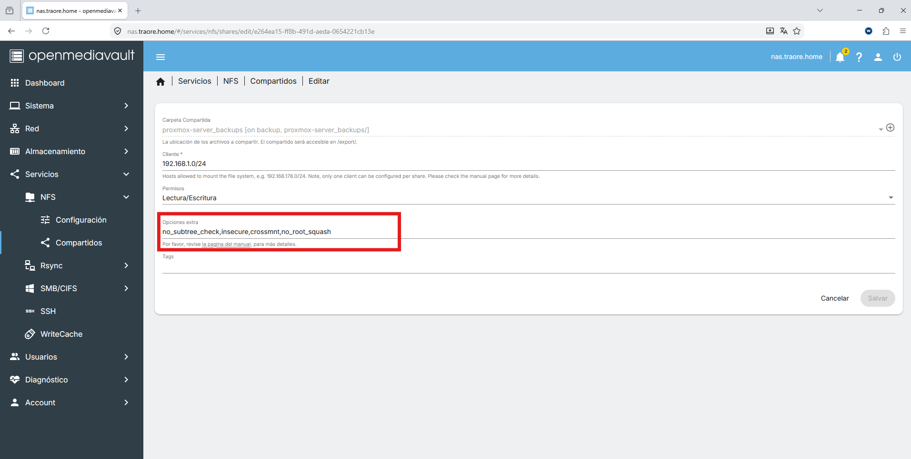
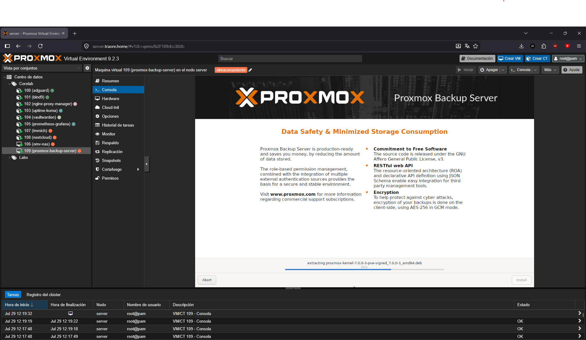
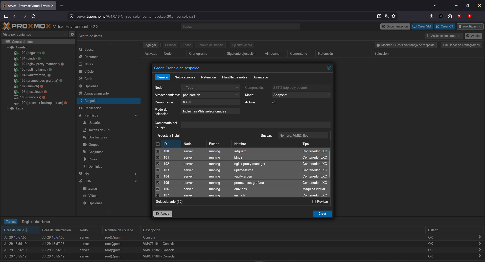
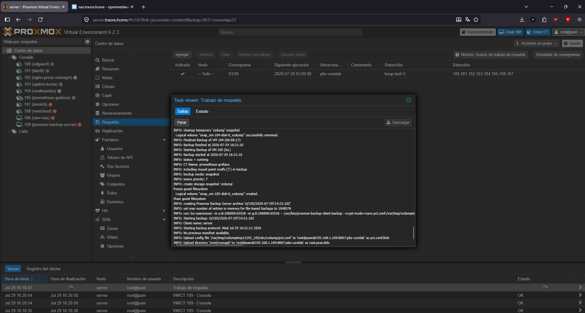
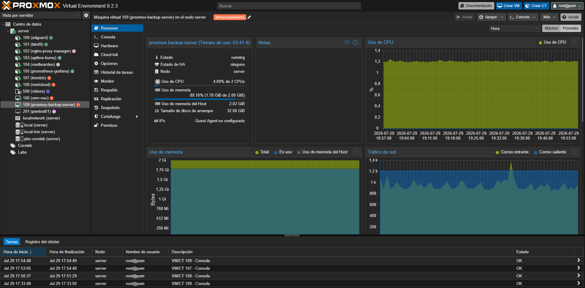
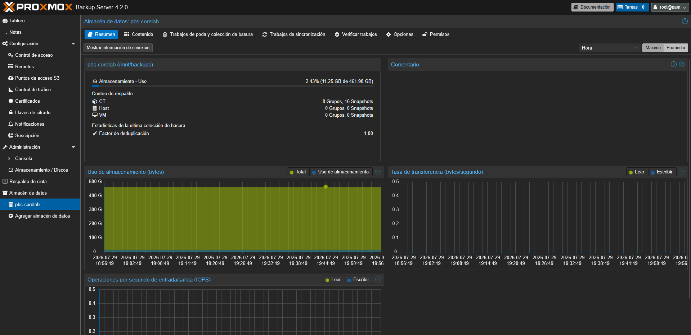

# Proxmox Backup Server

## Descripción

Proxmox Backup Server (PBS) es la solución oficial de Proxmox para backups incrementales y deduplicados de VMs y contenedores LXC. Lo uso para centralizar y automatizar los backups de todo el nodo CoreLab.

## Objetivo

Necesitaba backups reales del homelab, no solo snapshots locales en el mismo disco del host. PBS permite backups incrementales con deduplicación (ahorra mucho espacio frente a copias completas), verificación de integridad, y separación física del almacenamiento de backup respecto al almacenamiento de producción, todo integrado nativamente con Proxmox VE sin herramientas de terceros.

## Integración en la infraestructura

- Desplegado como VM independiente (`192.168.1.109`) en el mismo nodo Proxmox del CoreLab
- El datastore de PBS (`pbs-corelab`) vive sobre un mount NFS hacia el pool ZFS `backups` de OpenMediavault (VM 106), en vez de sobre disco local, separando el almacenamiento de backup del almacenamiento de producción
- Registrado como storage tipo "Proxmox Backup Server" en el Datacenter del nodo Proxmox VE, lo que permite lanzar backup jobs directamente desde la interfaz de Proxmox sobre las LXC y VMs del CoreLab

## Recursos asignados

| Recurso | Valor |
|---------|------:|
| **VM** | 109 |
| **vCPU** | 2 |
| **RAM** | 4 GB |
| **Disco SO** | 32 GB |
| **Datastore** | NFS |
| **IP** | 192.168.1.109 |

```text
Proxmox VE (server) ──backup job──► Proxmox Backup Server (VM 109)
                                              │
                                              └── mount NFS ──► OpenMediavault (VM 106)
                                                                      │
                                                                      └── pool ZFS `backups`
```

## Configuración 

- **VM:** 109
- **Datastore:** `pbs-corelab` (461.98 GB disponibles)
- **Backing path:** `/mnt/backups` (mount NFS persistente vía `/etc/fstab`)
- **Export NFS origen:** `192.168.1.106:/export/proxmox-server_backups`



- **Repositorio APT:** cambiado de `enterprise` (requiere suscripción) a `pbs-no-subscription`, ya que no tengo la licencia de pago



- **Storage registrado en Proxmox VE:** `Datacenter → Almacenamiento → Agregar → Proxmox Backup Server`, apuntando a `192.168.1.109`, datastore `pbs-corelab`, autenticado con `root@pam` y verificado con el fingerprint SHA-256 del certificado (obtenido con `proxmox-backup-manager cert info`)

- **Backup job creado:** todos los guests del nodo (100-109), cronograma diario a las 03:00, modo Snapshot, compresión ZSTD, retención `keep-last=2` (solo se conservan las 2 copias más recientes, se purga automáticamente la más antigua)

## Incidencias encontradas

- **El servicio NFS de OMV aparecía "habilitado" en la interfaz pero `/etc/exports` estaba vacío**: el interruptor general de NFS en Servicios > NFS > Configuración estaba desactivado a nivel de sistema, aunque el share individual sí estuviera creado. Solución: activar el toggle general del servicio NFS en OMV, no solo crear el share.



- **`EPERM: Operation not permitted` al crear el datastore en PBS**: el export de OMV tenía `root_squash` activo por defecto, impidiendo que PBS (que opera como root) creara la estructura de carpetas del datastore. Solucionado añadiendo `no_root_squash` a las opciones extra del share NFS en OMV.



## Ejemplos


*Ejemplo de instalación de Backup Server*


*Ejemplo de configuración de copia de seguridad*


*Ejemplo de copia de seguridad, en ejecución*


## Estado actual

---

