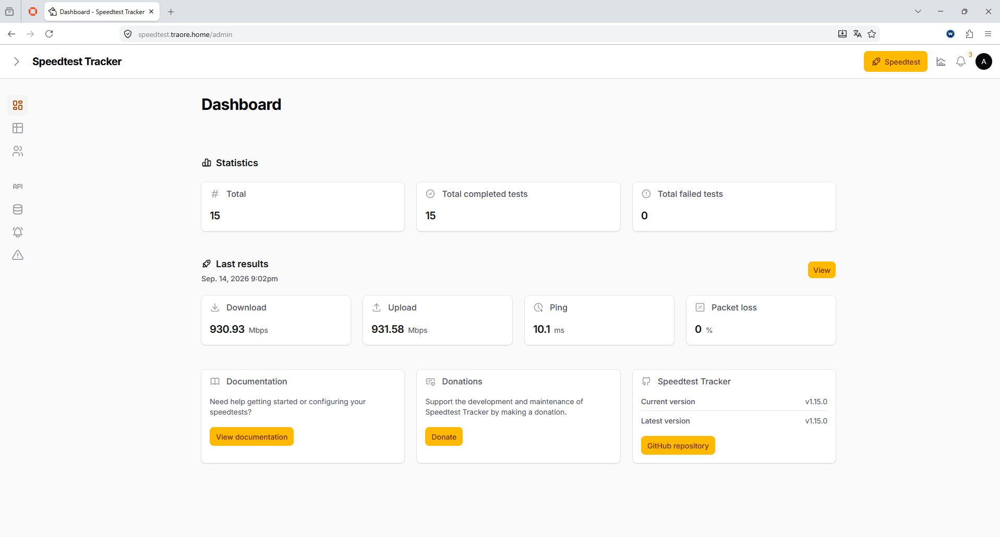
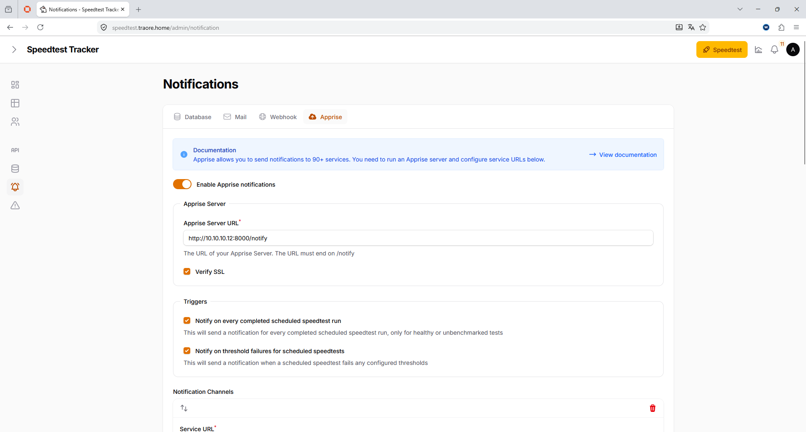

# Speedtest Tracker — Monitorización de Velocidad de Red

## Descripción

Speedtest Tracker ejecuta pruebas periódicas de velocidad de banda (Ookla
speedtest) y archiva los resultados para poder consultar la evolución temporal
del enlace de fibra del homelab (descarga, subida, latencia y *jitter*).

## Integración en la infraestructura

- **Contenedor:** LXC 112 `core-speedtest` (`10.10.10.12`, servicio en el
  puerto `8765`).
- **DNS:** registro `speedtest IN A 192.168.1.100` en la zona BIND9
  (`traore.home`).
- **Proxy:** *proxy host* de Nginx Proxy Manager
  `https://speedtest.traore.home → http://10.10.10.12:8765` con el
  certificado wildcard y HTTPS forzado.

## Problemas encontrados

- Si el contenedor está detenido, NPM devuelve **502 Bad Gateway**: reactivalo
  con `pct start 112`.

## Ejemplos

*Dashboard con el histórico de medidas del enlace (≈930 Mbps de bajada)*

*Configuración de notificaciones vía Apprise (avisos por cada test programado)*
