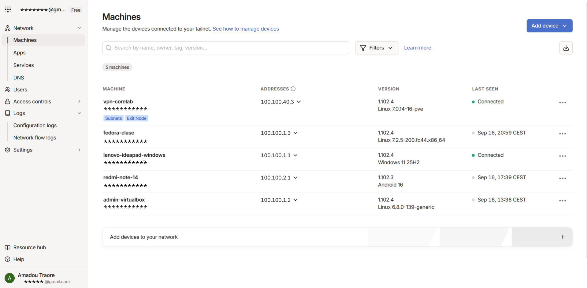
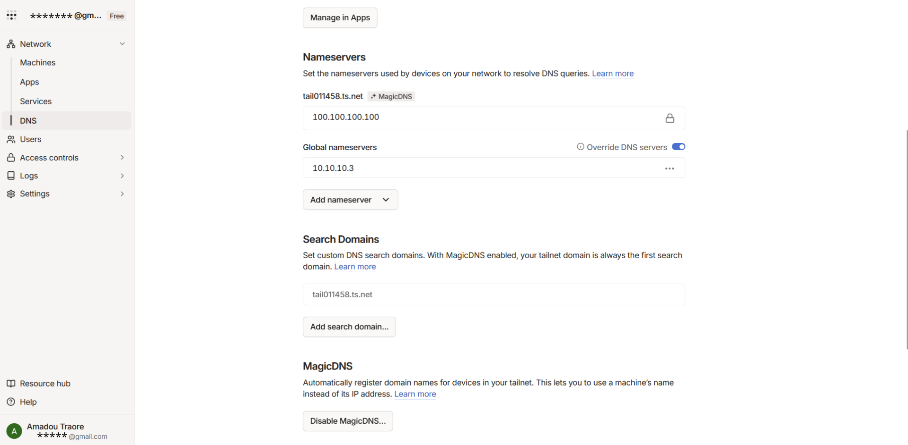
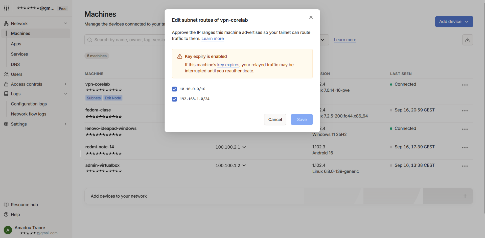

# Tailscale — VPN Mesh de Contingencia

## Descripción

Tailscale es la segunda vía de acceso remoto del CoreLab, basada en una red mesh (malla) sobre WireGuard gestionada desde un panel de administración centralizado. Complementa al WireGuard tradicional ya desplegado en el homelab, añadiendo un nodo (`vpn-corelab`) que actúa como subnet router y exit node, capaz de anunciar las redes internas del laboratorio al resto de dispositivos del tailnet sin necesidad de configurar túneles ni claves a mano en cada equipo.

## Objetivo

Evitar depender de un único punto de acceso remoto y simplificar la conexión de los miembros de la familia a los servicios domésticos, con los siguientes propósitos:

1. **Redundancia del acceso remoto:** disponer de una vía alternativa a WireGuard en caso de que este falle o quede inaccesible, sin depender de un solo LXC ni de gestión manual de peers.
2. **Acceso simplificado para uso familiar:** dar a los dispositivos de la familia (móviles, portátiles) acceso directo a Immich y Nextcloud mediante la app de Tailscale, sin exponer credenciales de administración ni tocar configuración de VPN.
3. **Resolución DNS coherente en remoto:** que los clientes conectados por Tailscale resuelvan tanto los nombres del tailnet como los subdominios internos del CoreLab (`*.traore.home`) a través del mismo AdGuard Home que ya filtra el resto de la red.

## Integración en la infraestructura

Tailscale se apoya en un nodo dedicado (`vpn-corelab`) dentro de la VLAN 40 (Acceso VPN), que anuncia como subredes accesibles tanto las VLANs internas del CoreLab como la LAN doméstica:

- **Panel de administración (Machines):** lista los dispositivos dados de alta en el tailnet, cada uno con IP fija en el rango `100.100.x.x` propio de Tailscale, independiente del esquema de VLANs del homelab.
- **vpn-corelab (subnet router / exit node):** nodo desplegado en el CoreLab con los roles `Subnets` y `Exit Node` habilitados; es el único punto que enruta tráfico entre el tailnet y las redes internas.
- **DNS (AdGuard Home, `10.10.10.3`):** configurado como Global Nameserver con `Override DNS servers` activado, para que cualquier dispositivo del tailnet use AdGuard como resolver por defecto en lugar del DNS del proveedor de turno.
- **MagicDNS (`tail011458.ts.net`):** activado sobre el dominio propio del tailnet, permitiendo referirse a cada máquina por su nombre corto en vez de por su IP `100.100.x.x`.
- **Subnet routes anunciadas por `vpn-corelab`:** `10.10.0.0/16` (VLANs internas: Core, Mini-SOC, Labs, VPN, Management) y `192.168.1.0/24` (LAN doméstica, para llegar a dispositivos que no están dados de alta como nodos Tailscale).

```text
                    Tailnet (100.100.0.0/16, MagicDNS)
                                │
         ┌──────────────────────┼──────────────────────┬──────────────────────┐
         ▼                      ▼                      ▼                      ▼
   fedora-clase          lenovo-ideapad          redmi-note-14          admin-virtualbox
   (equipo clase)         (portátil)                (móvil)              (VM de pruebas)
         │                      │                      │                      │
         └──────────────────────┴──────────────────────┴──────────────────────┘
                                         │
                                         ▼
                          vpn-corelab (Subnet Router / Exit Node)
                          DNS → AdGuard Home 10.10.10.3
                                         │
         ┌──────────────────────────────┼──────────────────────────────┐
         ▼                                                              ▼
Rutas anunciadas: 10.10.0.0/16                             Ruta anunciada: 192.168.1.0/24
(VLANs internas: Core, SOC,                                     (LAN doméstica)
Labs, VPN, Management)
```

Ambas rutas quedan pendientes de aprobación manual desde el panel de administración: hasta que no se aprueban, el tailnet no las usa aunque el nodo ya las esté anunciando. El aviso de *Key expiry* del panel indica además que, si la clave de `vpn-corelab` expira sin renovarse, el tráfico relayado hacia esas subredes se interrumpe hasta reautenticar el dispositivo — por ser el subnet router principal, conviene desactivar la expiración de clave en este nodo.

## Problemas encontrados

- Por defecto, Tailscale no fuerza todo el tráfico del cliente a pasar por el tailnet (sin full-tunnel activo), por lo que el uso de AdGuard como DNS solo aplica a las resoluciones, no al resto del tráfico saliente. Queda pendiente activar el enrutado completo para que, al conectar Tailscale, todo el tráfico pase también por AdGuard y quede monitorizado, con la excepción del dominio `*.iesthosicodina.cat` (aula virtual del instituto), que debe quedar fuera del túnel para poder seguir accediendo a clase con la VPN activa.
- Las ACLs de Tailscale todavía no están afinadas por tags (`admin` para acceso completo a Core, `family` limitado solo a Immich/Nextcloud); de momento el acceso es el mismo para todos los dispositivos del tailnet.

## Ejemplos


*Centro de administración de Tailscale*


*Configuración de DNS, apuntando hacia Adguard Home*


*Rutas de subred anunciadas, enrutamiento hacia Corelab*
