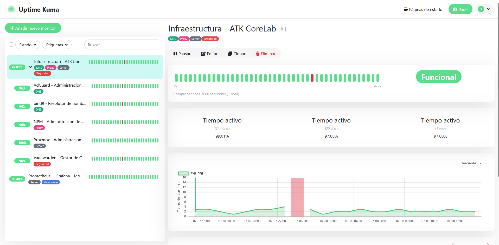

# Uptime Kuma

## ¿Qué es?

Uptime Kuma es una herramienta de monitorización de disponibilidad que
comprueba periódicamente si los servicios están activos y accesibles, con la posibilidad de avisar cuando alguno se cae (mediante Telegram).

## ¿Por qué lo elegí?

Lo elegí porque es una herramienta ligera, con interfaz web muy clara, y
pensada específicamente para la monitorización de disponibilidad , a
diferencia de Prometheus + Grafana, que está más orientado a métricas de
rendimiento (CPU, RAM, disco). Uptime Kuma, es una herramienta mucho mas sencilla que la principal utilidad es si se encuentran disponibles los servicios.

## Cómo encaja en mi infraestructura

- Desplegado en LXC 103 (Debian 12)
- Monitoriza cada servicio del laboratorio mediante comprobaciones HTTP(S)
  periódicas contra su URL (`.traore.home`)
- Complementa a Prometheus + Grafana
- Accesible en `uptime.traore.home` vía Nginx Proxy Manager (HTTPS)

## Configuración relevante

- **Monitores configurados:** uno por cada servicio activo del laboratorio
  (AdGuard Home, BIND9, Nginx Proxy Manager, Vaultwarden, Prometheus/Grafana)
- **Intervalo de comprobación:** cada 180 segundos (3 minutos), cuanto menos tiempo comprueba, mas recursos utiliza.
- **Tipo de comprobación:** HTTP(S) contra la URL pública interna de cada servicio o DNS hacia [BIND9](/docs/services/bind9.md).

## Ejemplos

*Panel principal mostrando el estado de todos los servicios monitorizados*

