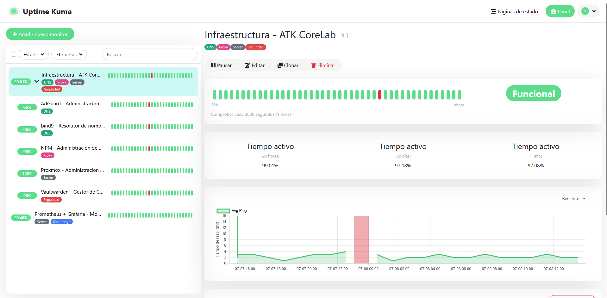
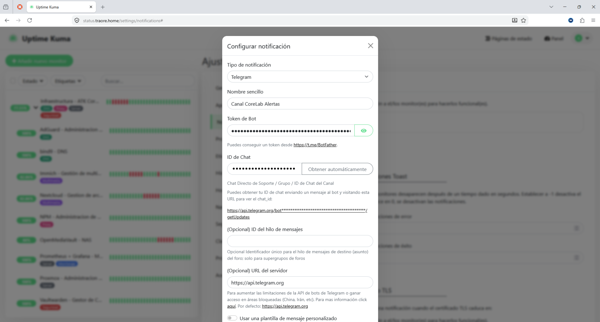
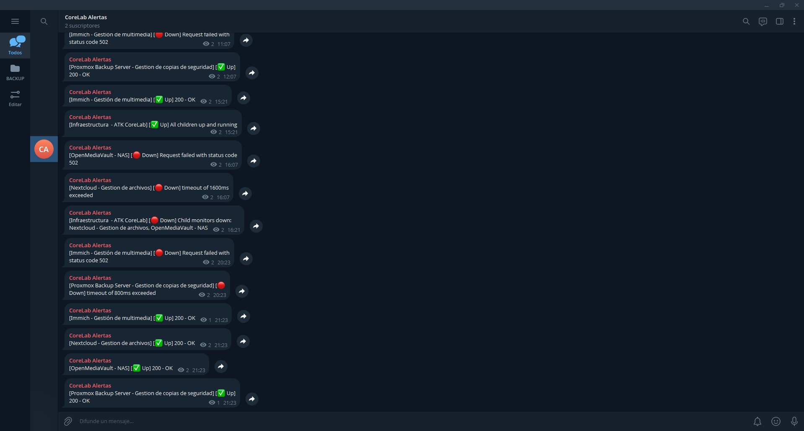

# Uptime Kuma

## Descripción

Uptime Kuma es una herramienta de monitorización de disponibilidad que comprueba periódicamente si los servicios están activos y accesibles, con notificaciones automáticas cuando alguno se cae (vía Telegram).

## Objetivo

Lo elegí porque es una herramienta ligera, con una interfaz web muy clara, y pensada específicamente para la monitorización de disponibilidad, a diferencia de Prometheus + Grafana, que está más orientado a métricas de rendimiento (CPU, RAM, disco). Uptime Kuma es mucho más sencillo: su utilidad principal es saber al instante si un servicio está disponible o no.

## Integración en la infraestructura

- Desplegado en LXC 103 (Debian 12)
- Monitoriza cada servicio del laboratorio mediante comprobaciones HTTP(S) periódicas contra su URL (`.traore.home`)
- Complementa a Prometheus + Grafana
- Expuesto en NPM como `uptime.traore.home`
- Notificaciones enviadas a un bot/canal de Telegram dedicado (`CoreLab Alertas`) en cada cambio de estado

```text
Servicios monitorizados (AdGuard, BIND9, NPM, Vaultwarden,
Immich, Nextcloud, OpenMediaVault, PBS, Grafana...)
     │
     └── check HTTP(S)/DNS cada 180s ──► Uptime Kuma (LXC 103)
                                                │
                                                └── evento Up/Down ──► Bot Telegram ──► Canal "CoreLab Alertas"
```

## Recursos asignados

| Recurso | Valor |
|---------|------:|
| **LXC** | 103 |
| **Hostname** | status.traore.home |
| **SO** | Debian 12 |
| **Proxy** | Nginx Proxy Manager |

## Configuración

| Parámetro | Valor |
|-----------|-------|
| Monitores | Uno por servicio activo del laboratorio |
| Intervalo de comprobación | 180 segundos |
| Tipo de comprobación | HTTP(S) / DNS |
| Notificaciones | Telegram (bot + canal dedicado) |

## Ejemplos


*Panel principal mostrando el estado de todos los servicios monitorizados*


*Configuración de la notificación de Telegram (token y chat ID)*


*Canal "CoreLab Alertas" recibiendo notificaciones de Up/Down en tiempo real*