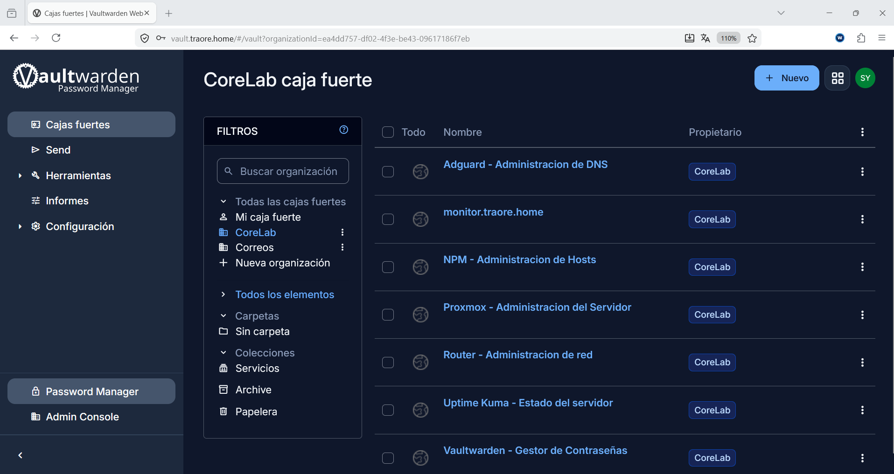
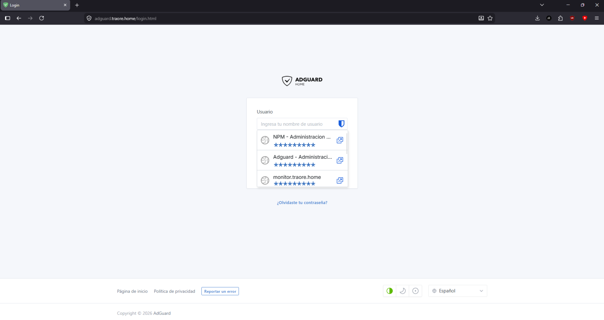
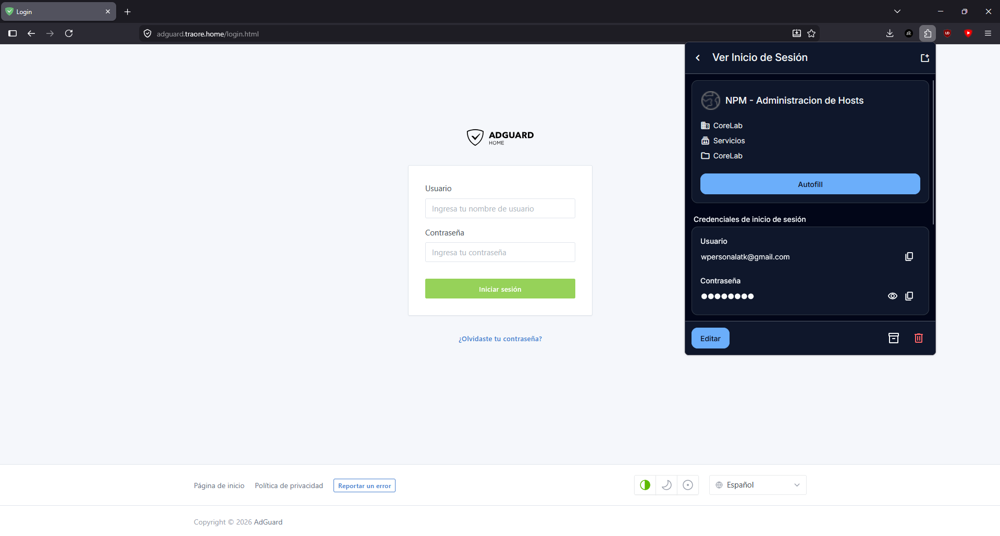
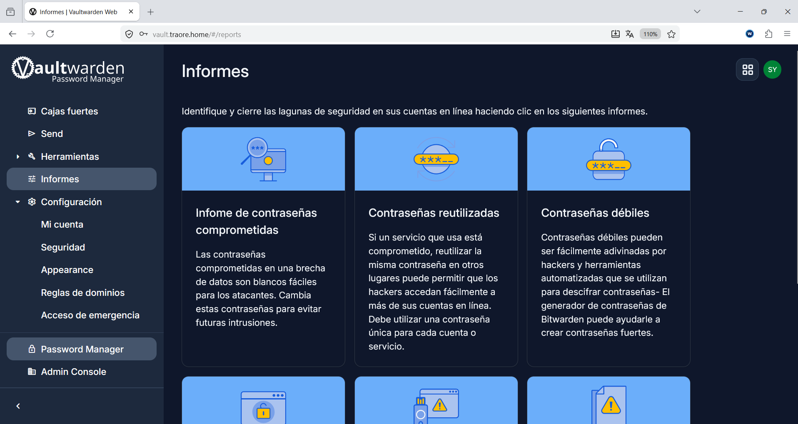
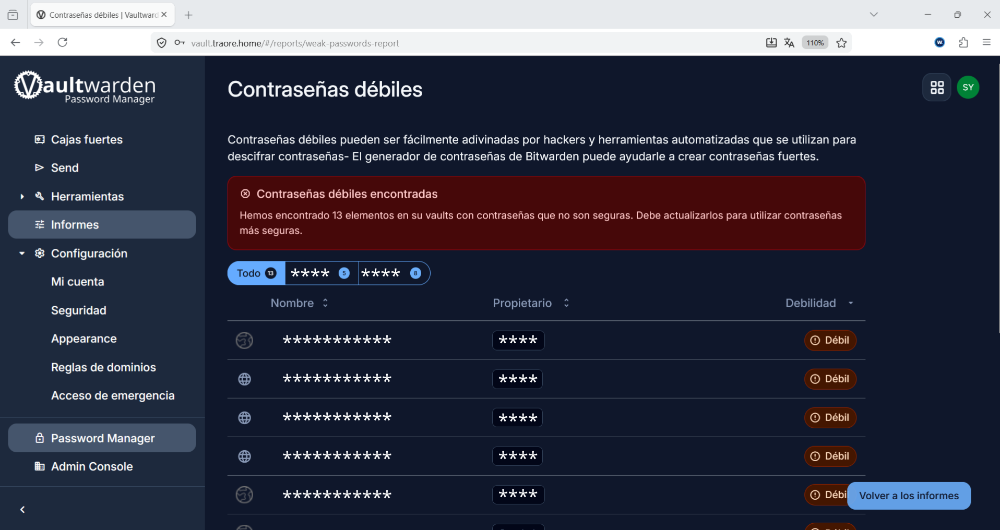

# Vaultwarden

## ¿Qué es?

Vaultwarden es un gestor de contraseñas, más ligero que Bitwarden. Permite almacenar y sincronizar
credenciales de forma cifrada entre dispositivos, sin depender de un
proveedor externo y tu desde manera local.

## ¿Por qué lo elegí?

Me permite tener un gestor de contraseñas centralizado tanto para mi propio uso como
para compartir credenciales de forma segura con mi familia, sin depender de
servicios de terceros como el que usaba hasta de google. Vaultwarden
me permite tener control total sobre dónde se almacenan los datos, además de
ser mucho más ligero que el servidor oficial de Bitwarden,
lo cual encaja bien para gastar recursos en otros servicios..

## Cómo encaja en mi infraestructura

Està desplegado en la LXC 104 (192.168.1.104), corriendo como contenedor
**Docker** dentro de la propia LXC — a diferencia de servicios como AdGuard
Home o BIND9, que corren de forma nativa sin contenedores.

El servicio está publicado a través de Nginx Proxy Manager con HTTPS,
accesible en la dirección `vault.traore.home`, usando el mismo certificado
wildcard interno que el resto de servicios del homelab. También es accesible
de forma remota a través del túnel WireGuard, sin exponer ningún puerto
directamente a internet.

Para compartir credenciales con mi familia sin dar acceso a la bóveda
completa, configuré una estructura de **organización + collections**, que
permite un control granular de qué credenciales ve cada miembro.

## Configuración importante

- **Acceso:** `vault.traore.home` (HTTPS vía Nginx Proxy Manager)
- **Certificado:** CA interna instalada manualmente en Android y mediante
  perfil de configuración (mobileconfig) en iOS, necesario para que los
  clientes móviles confíen en el certificado wildcard del homelab
- **Correo (SMTP):** para invitaciones y recuperación de cuenta, se usa un
  relay SMTP externo (Brevo o Gmail SMTP) en vez de montar un servidor de
  correo propio, evitando la complejidad de gestionar SPF/DKIM/DMARC y
  reputación de IP

## Ejemplos

*Vista de la caja fuerte con las credenciales almacenadas*

*Ejemplo de inicio de sesión en AdGuard usando una credencial guardada en Vaultwarden*

*Extensión de navegador de Vaultwarden, permite autocompletar credenciales directamente*

*Panel de informes generales de la bóveda*

*Informe de salud de contraseñas, detectando las contraseñas débiles*

#