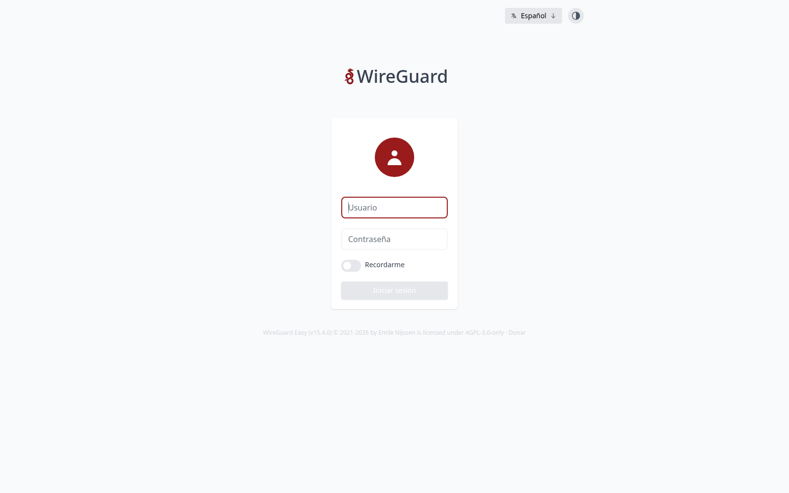
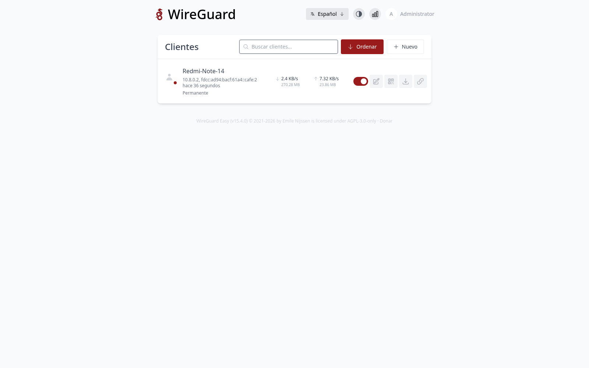

# WireGuard (wg-easy) — VPN de Acceso Remoto Principal

## Descripción

WireGuard desplegado mediante [wg-easy](https://github.com/wg-easy/wg-easy)
(contenedor Docker con panel web y API de gestión de peers) dentro de un LXC
dedicado (`vn-wireguard`, VMID 402) en la VLAN 40 (Acceso VPN). Es la vía
principal de acceso remoto al CoreLab: el túnel concede a los clientes IP
dentro de `10.8.0.0/24` y enruta el tráfico completo (*full tunnel*) a través
de la conexión doméstica, quedando expuesto al exterior únicamente el puerto
**UDP 51820**.

## Objetivo

1. **Acceso remoto completo:** que dispositivos móviles y portátiles fuera de
   casa lleguen al homelab (y a Internet vía OPNsense) con un único túnel
   WireGuard, usando *AllowedIPs* `0.0.0.0/0` y `::/0`.
2. **Gestión sin CLI:** administrar peers desde una interfaz web (crear,
   revocar, ver tráfico, exportar configuración y QR) en lugar de editando
   `wg0.conf` a mano.
3. **Exposición mínima:** solo el puerto UDP del túnel queda visible en
   Internet; la UI de administración se publica únicamente en el dominio
   interno `wg.traore.home` a través de Nginx Proxy Manager con HTTPS forzado.

## Integración en la infraestructura

- **Contenedor:** LXC 402 `vn-wireguard` (Debian 12, `10.10.40.2/24`,
  puerta de enlace `10.10.40.1`, DNS `10.10.10.3`, *search domain*
  `traore.home`), sin privilegios con `nesting`/`keyctl` y acceso a
  `/dev/net/tun`; 2 vCPU / 1 GiB RAM / 8 GiB disco, arranque automático.
- **Software:** Docker CE + Compose; servicio `wg-easy`
  (`ghcr.io/wg-easy/wg-easy:15`) en `/etc/docker/containers/wg-easy/`.
  Expone **51820/udp** (túnel) y **51821/tcp** (UI/API).
- **Red del túnel:** servidor `10.8.0.1`, clientes en `10.8.0.0/24`
  (con IPv6 `fdcc:...::/64`), DNS interno `10.10.10.3` (AdGuard Home) y
  *full tunnel* con *masquerade* por `eth0` — el acceso a las VLANs y a la
  LAN sale enrutado por la puerta `10.10.40.1` (OPNsense).
- **DDNS:** cron en el propio contenedor (`/etc/cron.d/duckdns`, cada 5 min)
  actualiza `traore.duckdns.org` con la IP pública; el endpoint de los peers
  usa ese dominio, de modo que un cambio de IP del proveedor no invalida las
  configuraciones.
- **Puerto forwarding (doble NAT):**
  - *Huawei BE3* (`192.168.1.1`): *Virtual Server* WAN **UDP 51820 →
    192.168.1.100:51820** (regla `WireGuard`, con NAT *hairpin* para poder
    probar también desde la LAN).
  - *OPNsense* (`192.168.1.100`): NAT `rdr` + regla de filtro hacia
    `10.10.40.2:51820` (ya existentes).
- **UI interna:** registro `wg IN A 192.168.1.100` en la zona BIND9
  (`traore.home`) + *proxy host* de NPM `wg.traore.home → http://10.10.40.2:51821`
  con el certificado wildcard y HTTPS forzado.
- **Relación con Tailscale:** Tailscale (`vpn-tailscale`, LXC 403) queda como
  vía de contingencia — ver [`tailscale.md`](tailscale.md).

```text
        Internet (UDP 51820)
               │
               ▼
      Huawei BE3 192.168.1.1   ← Virtual Server: UDP 51820 → 192.168.1.100
               │
               ▼
      OPNsense 192.168.1.100   ← NAT + filtro → 10.10.40.2
               │
               ▼
  ┌── VLAN 40 ────────────────────────────────┐
  │  LXC 402 vn-wireguard 10.10.40.2          │
  │  wg-easy: wg0 (10.8.0.0/24)               │
  │  51820/udp (túnel) · 51821/tcp (UI/API)   │
  └───────────────────────────────────────────┘
               ▲
               │ https://wg.traore.home
  LAN/VLANs → BIND9/AdGuard → NPM (10.10.10.5) → 10.10.40.2:51821
```

## Gestión de clientes

- **UI:** `https://wg.traore.home` (solo red interna). Permite crear y
  revocar peers, ver el último *handshake* y tráfico, y descargar la
  configuración `.conf` o el QR de cada cliente.
- **API REST** (autenticación HTTP Basic sobre HTTPS): `GET/POST
  /api/client`, `GET /api/client/{id}/configuration`, borrado con
  `DELETE /api/client/{id}`. Al crear un cliente es obligatorio el campo
  `expiresAt` (admite `null` para sin expiración).
- **Ejemplo de configuración de cliente:** interfaz `10.8.0.x/32` con
  `DNS = 10.10.10.3`, MTU 1420, y par con `Endpoint =
  traore.duckdns.org:51820`, clave precompartida y `AllowedIPs = 0.0.0.0/0,
  ::/0`.

## Problemas encontrados

- **Doble NAT y hairpin:** con solo el NAT de OPNsense, los paquetes hacia la
  IP pública no llegaban porque el Huawei no tenía ninguna regla de reenvío.
  Se creó el *Virtual Server* WAN UDP 51820 vía la API del router (login
  SCRAM + endpoints `app/application` y `ntwk/portmapping`); la llegada al
  contenedor se verificó con `tcpdump`, observando el paquete con la fuente
  reescrita a la IP WAN del Huawei.
- **Caché negativa de DNS:** al añadir el registro `wg` en BIND9, AdGuard
  Home siguió devolviendo NXDOMAIN durante días por el *Negative Cache TTL*
  del SOA (`604800` s = 7 días). Solución: reiniciar AdGuard
  (`systemctl restart AdGuardHome`) o vaciar su caché tras modificar la zona.
- **Reinicio de los `INIT_*` de wg-easy:** las variables de inicialización
  (`INIT_*`) deben eliminarse del `docker-compose.yml` una vez aplicada la
  configuración inicial; si permanecen, el servicio intenta reconfigurarse en
  cada arranque.
- **Validación de contraseña de la UI (mínimo 12 caracteres):** el formulario
  de login exige contraseñas de al menos 12 caracteres y no envía nada si no
  se cumple, de modo que una contraseña más corta —aunque sea la real— da
  error en cliente. Solución: regenerar el hash directamente en la base de
  datos SQLite del servicio (`/etc/wireguard/wg-easy.db`, tabla
  `users_table`, formato **argon2id**, `m=65536, t=3, p=4`) y reiniciar el
  contenedor; verificado que la API básica y el login web responden con la
  nueva contraseña (`200`) y rechazan la antigua (`401`).
- **Credenciales:** ningún secreto (contraseñas, tokens, claves) se documenta
  ni se committea en este repositorio — ver `.gitignore`; la UI debe usar una
  contraseña de 12+ caracteres.

## Ejemplos


*Inicio de sesión de wg-easy (la UI exige contraseñas de 12+ caracteres)*


*Lista de clientes: el peer «Redmi-Note-14» (10.8.0.2) con handshake reciente y tráfico circulando*
